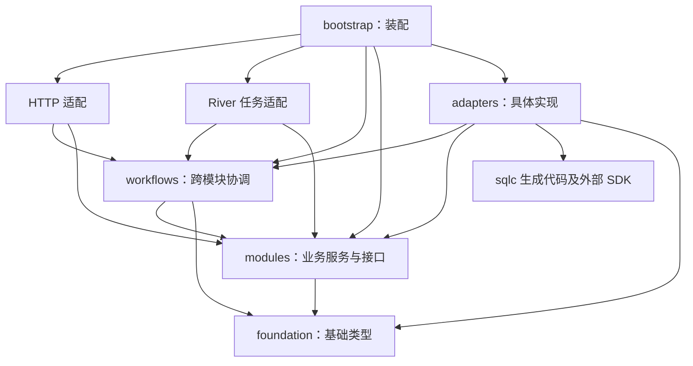

# Tripfolio 后端代码层级结构设计 v0.2

日期：2026-09-11；v0.2 同步修订于 2026-09-12  
状态：已获用户批准（2026-09-11）；后续接口与数据库设计以此为结构基线。v0.2 只按需求 v0.3 的范围调整模块命名与映射，不改变分层与依赖规则：journal 包改为 album；finance 不再含预算聚合，改为管理账号级账单分类；取消行程与其他记录的关联及旅行概览后，workflows/travel 暂无用例，目录预留。  
设计依据：P0 核心需求清单 v0.3、技术选型与架构建议 v0.2。  
技术基线：Go、Chi、PostgreSQL、sqlc、pgx、Goose、River、OpenAPI。  
审批范围：后端目录、模块职责、依赖方向、事务与同步入口、生成代码和测试的归属。

本轮交付设计文档。用户已批准本结构，并要求继续设计接口及数据库表结构；当前进入详细设计阶段。

## 1. 结构选择

推荐采用 **单 Go Module、按业务分包、业务包内轻量分层、集中管理入口与基础设施适配**。

| 方案 | 特点 | 本项目取舍 |
| --- | --- | --- |
| 按业务分包，推荐 | 同一业务的模型、规则、服务和所需接口集中，HTTP 与数据库实现分别适配 | 方便个人与 AI 聚焦修改，同时保留清晰依赖边界 |
| 全局按技术层分包 | 所有 handler、service、repository 各放一个目录 | 初期简单，功能增加后一次业务修改容易分散到多个大目录 |
| 完整领域分层 | 每个业务都细分多层目录、通用抽象和大量接口 | 当前规模下组织与装配成本较高，可在真实复杂度出现时局部细化 |

目录首先表达业务职责。统一写事务、同步协议、文件与后台任务通过少量明确接口衔接，避免各业务自行实现一套基础流程。

## 2. 仓库与后端目录

以下为计划结构，根目录为 `D:/Code/Tripfolio`。目录按功能实际落地，不要求一次生成所有空文件。

```text
D:/Code/Tripfolio/
├─ apps/
│  └─ server/                         # 一个 Go Module
│     ├─ cmd/
│     │  ├─ api/main.go               # HTTP 服务入口
│     │  ├─ worker/main.go            # River 消费进程入口
│     │  └─ migrate/main.go           # 发布时执行迁移的入口
│     ├─ internal/
│     │  ├─ bootstrap/                # 显式装配服务、仓储与适配器
│     │  │  ├─ api.go
│     │  │  ├─ worker.go
│     │  │  └─ migrate.go
│     │  ├─ config/                   # 配置读取、默认值与启动校验
│     │  ├─ transport/
│     │  │  ├─ httpapi/
│     │  │  │  ├─ generated/          # oapi-codegen 输出
│     │  │  │  ├─ middleware/         # 认证、限流、请求编号、恢复等
│     │  │  │  ├─ handler.go          # 聚合生成的 HTTP 接口实现
│     │  │  │  ├─ router.go           # Chi 注册与中间件顺序
│     │  │  │  ├─ server.go           # HTTP 超时与启停
│     │  │  │  ├─ travel_trip.go
│     │  │  │  ├─ travel_itinerary.go
│     │  │  │  ├─ travel_packing.go
│     │  │  │  ├─ travel_todo.go
│     │  │  │  ├─ travel_finance.go
│     │  │  │  ├─ travel_reservation.go
│     │  │  │  ├─ travel_album.go
│     │  │  │  ├─ account.go
│     │  │  │  ├─ assets.go
│     │  │  │  ├─ sync.go
│     │  │  │  ├─ data_management.go
│     │  │  │  └─ errors.go           # 业务错误到 HTTP 响应的映射
│     │  │  └─ river/                 # 作业参数解析、注册、调用应用服务
│     │  ├─ modules/
│     │  │  ├─ travel/
│     │  │  │  ├─ trip/               # 旅行基础、阶段、归档、回收站
│     │  │  │  ├─ itinerary/          # 每日行程、排序、完成状态
│     │  │  │  ├─ packing/            # 行李物品、准备状态、内置物品库
│     │  │  │  ├─ todo/               # 待办、截止日期、逾期规则
│     │  │  │  ├─ finance/            # 账单分类、账目、退款、统计
│     │  │  │  ├─ reservation/        # 预订与资料
│     │  │  │  └─ album/              # 照片记录、拍摄时刻、地点与说明
│     │  │  ├─ account/               # 身份、个人资料、会话及账号状态
│     │  │  └─ assets/                # 文件归属、状态、授权、引用管理
│     │  ├─ workflows/
│     │  │  ├─ travel/                # 预留；需求 v0.3 后暂无跨旅行业务包的用例
│     │  │  ├─ sync/                  # 增量拉取、操作分发、冲突处理
│     │  │  └─ datamanagement/        # 导出、跨模块清理、账号注销协调
│     │  ├─ adapters/
│     │  │  ├─ postgres/
│     │  │  │  ├─ pgcore/             # 连接池、事务、统一写入设施
│     │  │  │  ├─ dbgen/              # sqlc 输出
│     │  │  │  ├─ travel/             # 旅行各包的仓储与事务接口实现
│     │  │  │  ├─ account/            # 账号、资料与会话存储实现
│     │  │  │  ├─ assets/             # 文件元数据与引用存储实现
│     │  │  │  └─ workflows/          # 同步日志、导出状态等存储实现
│     │  │  ├─ objectstore/           # 对象存储实现；部署地域为大陆，优先阿里云 OSS，部署设计时确认
│     │  │  ├─ geo/                   # 高德 Web 服务 API 客户端：逆地理编码、地点搜索、限流与缓存
│     │  │  ├─ queue/                 # River 事务入队及任务结果适配
│     │  │  ├─ mail/                  # 阿里云邮件推送（DirectMail）投递验证码
│     │  │  └─ security/              # 密码哈希、凭证签发与验证
│     │  └─ foundation/               # 有限的通用值类型与基础约定
│     ├─ db/
│     │  ├─ migrations/              # Goose 业务迁移，模式的唯一手工来源
│     │  └─ queries/
│     │     ├─ travel/                # 按 trip、finance 等业务组织 SQL
│     │     ├─ account/
│     │     ├─ assets/
│     │     └─ workflows/
│     ├─ tests/
│     │  ├─ integration/             # PostgreSQL、River 与完整事务验证
│     │  ├─ contract/                # OpenAPI 与响应一致性验证
│     │  └─ testdata/                # 后端集成测试数据
│     ├─ sqlc.yaml
│     ├─ oapi-codegen.yaml
│     ├─ .env.example                # 配置字段示例，不含真实凭证
│     ├─ Dockerfile
│     ├─ README.md
│     ├─ go.mod
│     └─ go.sum
├─ packages/
│  └─ contracts/
│     ├─ openapi/v1/
│     │  ├─ openapi.yaml             # API 契约入口
│     │  ├─ paths/                   # 按旅行、账户、同步等拆分路径定义
│     │  └─ schemas/                 # 请求、响应与错误模型
│     └─ fixtures/                   # 金额、日期、同步等跨语言测试样例
├─ infra/                            # 本地开发依赖的 Compose（PostgreSQL、MinIO）与初始化脚本
└─ docs/
   ├─ requirements/
   └─ architecture/
```

`modules/travel`、`modules`、`adapters/postgres` 等上级目录主要用于分组；只有实际需要声明类型或函数的位置才建立 Go 包。后端采用一个 `go.mod`，当前无需按业务建立多个 Go Module。

## 3. 目录职责与边界

| 位置 | 负责的事情 | 边界 |
| --- | --- | --- |
| cmd | 调用启动流程、接收退出信号、报告启动失败 | 保持入口简短，业务规则放入模块 |
| bootstrap | 创建连接池、仓储、服务和处理器，控制生命周期 | 是连接具体适配器与业务接口的装配位置 |
| config | 读取环境配置，验证必要配置；开发环境启动时可从工作目录 `.env` 补充环境变量（进程环境变量优先，prod 不读） | 业务服务通过构造函数接收配置，不到处读取环境变量 |
| transport/httpapi | 请求解码、身份传递、参数转换、响应和错误映射 | 调用模块或协调流程，不直接调用 sqlc |
| transport/river | 解析任务参数，调用协调流程或模块服务 | 不复制一套 HTTP 业务逻辑，不直接修改业务表 |
| modules | 业务模型、校验、权限规则、应用服务与所需接口 | 不依赖 Chi、HTTP 生成模型、pgx、sqlc 生成代码或 River |
| workflows | 跨模块分发与协调 | 调用明确的业务能力，不直接执行 SQL；模块不反向调用 workflows |
| adapters | PostgreSQL、对象存储、队列和安全组件的具体实现 | 实现使用方声明的接口，负责外部类型与业务类型转换 |
| foundation | Actor、ID、Money、分页、错误码、时钟和写入元信息等基础约定 | 不依赖业务模块或基础设施；不扩张为通用业务服务容器 |
| db | 业务迁移与查询源文件 | 生成代码由这些受版本控制的源文件产生 |
| packages/contracts | 对外接口与跨语言语义 | Go 与前端分别生成或验证自己的模型 |

HTTP 接口可以由一个薄的处理器对象实现生成的完整接口，具体方法分散在对应业务文件中。该对象只负责分发和模型转换，各业务状态与规则保留在模块服务中。

## 4. 产品功能到代码的映射

| P0 功能 | 主要归属 | 说明 |
| --- | --- | --- |
| TR-00 旅行基础 | modules/travel/trip | 旅行规则、阶段、归档、回收站与总预算字段 |
| TR-01 每日行程 | modules/travel/itinerary | 计划、实际状态和排序；与其他模块没有关联 |
| TR-02 行李清单 | modules/travel/packing | 内置物品库放在包内 library 目录并随程序嵌入；批量创建 |
| TR-03 待办 | modules/travel/todo | 截止、完成和逾期规则 |
| TR-04 预算 | modules/travel/trip + modules/travel/finance | 总预算由 trip 写入，finance 的统计服务读取并计算余额 |
| TR-05 记账 | modules/travel/finance + modules/assets | category_service.go 管理账号级账单分类，ledger_service.go 统一支出与退款规则，票据文件复用 assets |
| TR-06 开支统计 | modules/travel/finance | statistics_service.go，复用相同金额语义 |
| TR-07 预订与资料 | modules/travel/reservation + modules/assets | 预订负责业务资料与其附件关系，assets 负责文件生命周期 |
| TR-08 相册 | modules/travel/album + modules/assets | album 负责照片记录、拍摄时刻、地点与说明，assets 负责文件与 EXIF 建议 |
| AC-01 账号与个人空间 | modules/account + modules/assets | account 负责身份与资料，头像文件复用 assets |
| AC-02 跨端同步与离线 | workflows/sync + 各业务写服务 | 服务端实现同步；客户端实现本地数据库和离线操作 |
| AC-03 数据管理 | workflows/datamanagement + account/trip/assets | 跨模块导出与清理；本地缓存清理由客户端承担 |

账单分类、记账和统计共同维护一份财务语义，因此放在一个 finance 包内，并用不同服务文件分工。总预算只是旅行的一个字段，由 trip 包维护，finance 只读取。

account 首版在一个业务包内，用 identity_service.go、profile_service.go、session_service.go 分开职责。跨旅行的数据导出和注销清理由 datamanagement 协调，避免账号包承担全部业务。

需求 v0.3 取消了旅行概览和行程项目与其他记录的关联，旅行业务包之间当前没有需要同事务协调的用例，workflows/travel 目录预留、暂不建立。删除预订时解除其资料的关联发生在 reservation 包内部。整趟旅行的删除与恢复规则仍由 trip 定义，到期清理与永久删除由 datamanagement 协调。

assets、workflows 和 adapters 属于后端支撑组织，不增加产品一级模块。

## 5. 单个业务包的文件约定

以 finance 为例，路径为 `D:/Code/Tripfolio/apps/server/internal/modules/travel/finance/`：

```text
finance/
├─ model.go                    # 账单分类、账目、退款、统计结果的业务类型
├─ commands.go                 # 写入命令，不使用 HTTP 请求类型
├─ queries.go                  # 查询条件与结果类型
├─ ports.go                    # 使用方需要的仓储、事务和外部能力接口
├─ category_service.go
├─ ledger_service.go
├─ statistics_service.go
├─ rules.go                    # 金额、币种和退款等共享业务校验
├─ errors.go                   # 本业务的错误语义
├─ ledger_service_test.go
├─ category_service_test.go
└─ statistics_service_test.go
```

简单模块可以合并 commands.go 与 queries.go，或只使用一个 service.go；按职责增长拆分，不为每个类型单独创建目录。

服务通过构造函数接收接口依赖。接口在使用方的 ports.go 中定义，只描述实际需要的能力，不建立包含所有表操作的通用 Repository。

需要跨模块写事务的业务包，可增加 mutations.go，提供绑定事务仓储的业务写入能力，供本包服务和 workflow 共用；该能力复用业务规则，不自行开启或提交事务。没有这类需求的包无需增加此文件。

数据库记录先由 PostgreSQL 适配器转换为业务模型，再由 HTTP 层转换为 API 模型。金额以精确业务类型处理，API 使用十进制字符串，pgx 的数据库类型不向客户端泄露。

## 6. 依赖方向

允许的主要依赖如下，箭头表示导入或调用方向：



适配器依赖业务接口，业务服务运行时通过接口调用已装配的实现；这不要求业务包导入适配器包。

依赖约束：

1. 业务服务不导入 transport、adapters 或 workflows，保持依赖指向业务规则，避免反向依赖和循环。
2. workflows 可以调用多个业务模块；旅行模块不直接调用账户服务，身份通过已验证的 Actor 与必要的归属查询传入。
3. 不同业务包需要关联校验时，优先声明窄接口，由适配器提供实现；确需跨模块行为时上移到 workflows。
4. dbgen 只被 PostgreSQL 适配器使用，HTTP generated 只被 HTTP 层使用。
5. pgcore 与 dbgen 是 PostgreSQL 适配的基础包，不导入各业务仓储适配包。postgres/workflows 可组合各业务的事务仓储，业务仓储不反向依赖它；bootstrap 负责最终装配。
6. River 任务名称和参数类型放在 adapters/queue，由投递适配器与 transport/river 共用；queue 不反向导入 transport。业务包通过自己的任务提交接口表达需求。
7. foundation 不导入上述上层包；没有全局可变数据库对象或随处访问的服务注册表。

审批后可在 CI 中检查禁止的导入关系，并通过 Go 编译检测实际循环依赖。本次文档检查不替代后续工程编译。

## 7. 写事务、同步与跨模块一致性

### 7.1 同一业务只有一套写规则

普通 REST 写请求与离线同步操作最终调用同一个业务入口：单模块操作进入业务写服务，跨模块操作进入对应 workflow。sync workflow 只处理同步协议、操作类型分发、批次结果和冲突展示，不重新实现记账、退款或清单规则。

单模块用例在业务包的 ports.go 中声明事务接口；跨模块用例在相应 workflow 的 ports.go 中声明所需事务范围。PostgreSQL 适配器提供绑定同一事务的窄仓储视图；pgcore 复用统一的事务设施。业务层不持有或断言 pgx.Tx。

跨模块 workflow 在一个事务范围内组合各模块的事务内写入能力，统一提交。例如，永久删除旅行时各业务包的行清理应在同一批事务边界内完成并记录变更；不能顺序调用几个各自提交的服务来实现这一要求。

### 7.2 统一写入流程

对于纳入同步范围的业务修改，一次写事务中应完成：

1. 在已认证身份下，获取账号同步序列所需的事务锁，并校验账号可写状态；所有相关写入口保持一致的锁顺序。
2. 在账号范围内检查 operation_id 与请求指纹；已成功的相同操作返回原结果，同一编号的不同内容返回冲突。成功重试不再次校验旧版本或修改数据。
3. 对新操作校验资源归属、关联资源和当前版本，再写入业务数据与新版本。
4. 分配同步序列，写入明确允许同步的变更快照或删除标记，并更新同步游标。
5. 保存操作结果；需要后台处理时通过 River 的事务入队接口记录任务。
6. 一起提交，失败时整体回滚。

检查去重与分配游标的并发细节由统一事务实现保证，不能只靠事务外的“先查询后插入”。唯一约束、行锁和回滚路径必须有集成测试。

事务视图只暴露当前用例所需的仓储能力。各模块仍负责业务校验，统一设施负责锁、去重、游标、日志和提交的一致性，避免统一设施演变成了解全部业务的服务。

### 7.3 事务边界

- 修改可同步业务数据的 REST、同步和后台任务使用同一写机制。
- 登录凭证、密码、内部队列状态等使用自己的事务规则，不进入旅行数据同步日志。
- 变更快照采用明确的字段白名单，不直接把数据库整行序列化为同步响应。
- 同步仅接收当前版本允许离线修改的操作类型；其他业务变更仍通过统一变更日志下发，不因此开放全部离线写能力。
- 同步按每个操作返回结果；不同操作可分别成功或冲突，不要求一个上传批次跨多条业务命令整体原子提交。
- 批次按约定顺序处理；依赖失败操作的后续操作返回依赖失败，客户端保留尚未成功的操作。
- 对象存储访问、图片处理和导出流不占用长时间数据库事务；提交任务后由 worker 分阶段执行并记录状态。
- 删除与编辑冲突保留可处理的信息，旧客户端操作不能自动恢复已删除旅行。

### 7.4 查询

普通查询走对应模块的查询服务与仓储，按账号和旅行限定范围。统计在数据库中聚合并分页读取明细。增量同步由 sync workflow 查询变更存储；游标过期进入全量核对流程，同时保留客户端待同步操作。

## 8. 请求与后台任务示例

### 新增一笔开支

```text
HTTP 请求
→ httpapi：解码、认证上下文、API 模型转换
→ finance.LedgerService：通过事务接口进入统一写事务
→ 事务内取得账号锁、检查操作去重；新操作继续校验版本、归属和业务规则
→ PostgreSQL 适配：同一事务完成账目、版本、操作结果和变更日志
→ HTTP 业务结果转换与响应
```

离线同步中的新增开支先进入 sync workflow 分发，随后调用同一个 LedgerService。

### 导出旅行数据

```text
HTTP 请求
→ datamanagement：校验范围，记录导出请求并事务入队
→ 响应导出任务状态
→ transport/river：接收任务、解析参数
→ datamanagement：协调各模块读取，分页输出文件
→ objectstore 适配：保存私有导出包
→ 更新导出状态，由授权接口提供下载地址
```

River 任务适配只负责交付调用、取消和错误分类。账号注销、数据归属变化及任务重试仍由应用服务核对，不能以“后台任务”为理由跳过业务范围校验。

## 9. 生成代码、迁移与运行入口

- OpenAPI 的手工来源放在 packages/contracts/openapi/v1，Go 生成文件放在 transport/httpapi/generated。生成模型与业务模型分别维护转换。
- SQL 的手工来源放在 db/queries，业务模式由 db/migrations 演进；sqlc 输出放在 adapters/postgres/dbgen。生成文件提交后由 CI 检查是否与源文件一致。
- 修改接口或 SQL 时先改源文件，再生成代码；不手工修改生成文件。
- Goose 管理业务表，River 使用自身官方迁移流程。migrate 入口统一安排顺序、版本检查和失败退出，并防止并发迁移。
- API 与 worker 启动时校验依赖和模式兼容性；迁移作为发布步骤单独执行。
- API 负责 HTTP，worker 负责消费任务，两者共享同一 Go Module 和业务服务。分别配置连接池、并发与内存预算。
- 配置与凭证由环境提供，启动日志不输出秘密；HTTP 停止接收新请求后等待在途请求退出，worker 按 River 机制停止领取并处理退出。

## 10. 验证安排

| 验证位置 | 重点 |
| --- | --- |
| 业务包内 *_test.go | 预算、退款、物资状态、归档等规则与服务分支；使用小型假实现替代外部依赖 |
| tests/integration | 真实 PostgreSQL 下的权限范围、事务回滚、去重、游标顺序、删除冲突和 River 事务入队 |
| tests/contract | OpenAPI 校验、错误映射、金额和日期格式、分页及同步响应 |
| packages/contracts/fixtures | Go 与客户端共同核对金额、日期、状态和同步语义 |
| CI 结构检查 | 生成结果一致性、禁止导入关系、编译、静态检查和竞态检测 |
| 业务原型压测 | API 与 worker 的内存、延迟、连接池及任务并发，基于真实使用流程 |

本轮仅审查设计的职责覆盖与逻辑依赖，运行验证在工程创建后执行。

## 11. 本次审批要点

1. 后端放在 apps/server，使用一个 Go Module，API、worker、migrate 分别作为入口。
2. 旅行按业务分包；预算、记账、统计集中于 finance 包，以不同服务文件分工。
3. 账户基础能力由 account 包负责；同步、导出和清理由 workflows 中的对应包协调。
4. HTTP 与数据库各有适配层，业务服务依赖使用方定义的窄接口；通过 bootstrap 显式装配。
5. 可同步业务修改统一事务规则，网页操作、离线同步和后台修改复用同一业务入口；跨模块写入在一个事务范围内完成。
6. API 与 SQL 生成代码有固定来源和输出目录，测试按业务、集成和契约归属组织。

本结构已批准。按用户最新要求，先细化接口与数据库表结构，再安排工程骨架与实现步骤；具体云供应商配置在部署设计时确定。
