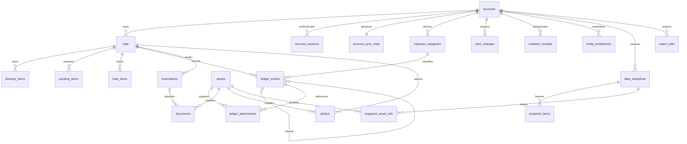

# Tripfolio P0 数据库表结构设计 v0.5

日期：2026-09-11；v0.2 修订于 2026-09-12；v0.3 修订于 2026-09-12  
状态：详细设计稿，供用户审阅；字段、约束和索引尚未转化为迁移执行。  
v0.4 修订于 2026-09-15：新增第 24 张表 trip_shares（旅行分享链接），不进入同步体系。  
v0.5 修订于 2026-09-16：头像外键的删除语义改用 assets 上的 BEFORE DELETE 触发器实现，去掉对 PostgreSQL 15+ 列子集语法的依赖，支持下限降到 PostgreSQL 13（自托管 NAS 实测版本）；表结构与语义不变。
v0.3 修订：按需求 v0.3 收敛范围。删除 trip_budgets、category_budgets、journal_entries，journal_photos 改名 photos 并增加拍摄时刻与地址；新增账号级 expense_categories，ledger_entries 改用 category_id；所有 itinerary_item_id 关联列与 ledger_entries.reservation_id 删除；总预算成为 trips.budget_amount；currency_locked_at 改为随有效账目数增减而写入与清空；sync_changes 与 snapshot_items 的 trip_id 允许为空以承载账号级实体；assets 增加 EXIF 建议列；坐标列统一注明 GCJ-02。表数 25 → 23。  
v0.2 修订：按 [P0 设计评审](../reviews/2026-09-12-P0设计评审.md) 第 1 节修正 M1–M15。本文件涉及：asset_uploads 并入 assets（表数 26 → 25）；会话表刷新令牌列与宽限期；头像外键改为列子集 SET NULL；索引方向与接口默认排序对齐、可空排序键改哨兵表达式；sync_changes 增加 changed_fields；写事务隔离级别与锁纪律；快照 worker 不再持账号锁；退款支出删除改为解除关联；预订与行程的单行 CHECK。  
基线：PostgreSQL 13+（开发与 CI 用 18；迁移与查询不使用 15+ 专有语法，自托管的 13/14 同样可用）、sqlc / pgx、Goose；业务表使用 public schema，River 自有表由其官方迁移单独管理。

## 1. 全局约定

- 23 张应用表分为账号、旅行、文件、同步和数据管理。Goose 版本表和 River 内部表不计入此数量，不自行设计或修改 River 内部字段。
- 表、列使用 snake_case。类型列给出 PostgreSQL 类型；“可空”表示 NULL，其余须按列的 NOT NULL 约定创建。未声明默认值的字段必须由服务端写入。
- B 组公共列为 id、account_id、version、created_at、updated_at、deleted_at；T 组在 B 组上增加 trip_id。账号级业务表（expense_categories）使用 B 组列而不带 trip_id，被引用时使用 (account_id, id) 两列外键。下文逐表列出展开后的全部字段。
- 每张 T 组表建立 UNIQUE(account_id,trip_id,id)，并建立 (account_id,trip_id) → trips(account_id,id) 的复合外键。跨业务关联使用同账号、同旅行的三列外键，避免仅凭全局 ID 建立错误归属。
- trips 建立 UNIQUE(account_id,id)。普通 B 组如 assets 按下文声明补齐复合唯一键。所有外键列要有匹配的前缀索引，已被主键或已有索引覆盖的除外。
- 业务外键默认 ON DELETE NO ACTION；用户删除由服务处理，不依赖数据库级联触发跨模块业务变更。仅明确列出的短期快照子表使用 ON DELETE CASCADE。
- 所有列出的固定枚举使用 varchar + CHECK；当前不使用 PostgreSQL ENUM，以便通过显式迁移调整。CHECK 无法验证另一行的业务状态，相关规则仍在统一写事务中检查。
- 金额采用 NUMERIC(18,4)，最多 14 位整数。API 接收十进制字符串，服务端验证币种小数位及数值范围，拒绝超精度；0 预算和未设置预算严格区分。
- 普通资源 ID 不依赖数据库递增值。bigint 版本和序列对外使用十进制字符串；日期/当地日期时间/绝对时间分别使用 date、timestamp without time zone、timestamptz。
- updated_at 由写服务维护，不依赖隐藏触发器。所有影响公开资源内容的关联修改也要递增资源 version 并记录同步事件。
- jsonb 仅用于有版本、字段受限的快照、任务请求范围和操作收据，不存放核心账目、预算或通用业务正文。
- 索引中的“有效记录”谓词指 deleted_at IS NULL；时间过期索引不使用 now() 等动态谓词，而以 expires_at 列配合查询条件。
- 列表索引的列顺序与方向必须与接口 3.9 的默认排序完全一致，键集分页用行比较走索引。可空排序键（due_on、start_local、recorded_on）不用 NULLS FIRST/LAST，而用 COALESCE 哨兵表达式建索引，ORDER BY 与游标谓词使用同一表达式。
- 事务隔离级别：可同步写事务使用 READ COMMITTED（账号写锁依赖“等待后重读最新行”的语义，REPEATABLE READ 下会以序列化失败告终）；统计、导出与快照的只读事务使用 REPEATABLE READ。连接统一设置 lock_timeout 与 statement_timeout。

## 2. 表总览

| 表 | 作用 |
| --- | --- |
| accounts | 账号与个人资料 |
| account_sessions | 登录与可撤销刷新会话 |
| auth_challenges | 邮箱验证码挑战 |
| trips | 旅行 |
| itinerary_items | 每日行程项目 |
| packing_items | 行李清单物品 |
| todo_items | 待办事项 |
| expense_categories | 账号级账单分类 |
| ledger_entries | 支出与退款账目 |
| ledger_attachments | 账目票据引用 |
| reservations | 预订 |
| documents | 独立资料与预订附件 |
| photos | 照片记录、拍摄时刻、地点与说明 |
| assets | 私有文件资产与当前上传尝试 |
| account_sync_state | 账号写锁与同步水位 |
| sync_changes | 提交有序的变更日志 |
| mutation_receipts | 成功操作去重收据 |
| entity_tombstones | 物理删除后的轻量墓碑 |
| data_snapshots | 短期不可变数据快照 |
| snapshot_items | 快照分页内容 |
| snapshot_asset_refs | 活动快照的文件保留引用 |
| export_jobs | 旅行包与账目 CSV 导出 |
| deletion_jobs | 永久清理与注销任务 |
| trip_shares | 旅行分享链接 |

## 3. 字段字典

### 1. accounts：账号与个人资料

| 字段 | PostgreSQL 类型 | 空值 / 默认 / 约束 | 说明 |
| --- | --- | --- | --- |
| id | uuid | PK | 账号 ID |
| email | varchar(254) | NOT NULL | 用于展示与投递的邮箱 |
| email_key | varchar(254) | NOT NULL UNIQUE | 去除首尾空格并按本产品规则大小写不敏感匹配的邮箱 |
| email_verified_at | timestamptz | NOT NULL | 注册完成前必须验证邮箱 |
| password_hash | text | NOT NULL | Argon2id PHC 字符串；不保存明文密码 |
| password_changed_at | timestamptz | NOT NULL DEFAULT now() | 密码变更时间 |
| nickname | varchar(64) | NOT NULL；长度 1–64 | 昵称 |
| avatar_asset_id | uuid | 可空 | 头像资产；只允许 avatar 范围 |
| default_timezone | varchar(64) | NOT NULL DEFAULT 'Asia/Shanghai' | 创建旅行时的默认 IANA 时区 |
| status | varchar(16) | NOT NULL DEFAULT 'active' | active / deleting |
| version | bigint | NOT NULL DEFAULT 1；CHECK > 0 | 个人资料版本；安全字段变化不向客户端公开 |
| created_at | timestamptz | NOT NULL DEFAULT now() | 注册时间 |
| updated_at | timestamptz | NOT NULL DEFAULT now() | 资料或账号状态更新时间 |

键与关联：

- PK(id)；UNIQUE(email_key)。
- (id, avatar_asset_id) → assets(account_id, id)，复合外键保证头像与账号同属；删除资产时只置空指针列 avatar_asset_id、不动 accounts.id，由 assets 上的 BEFORE DELETE 触发器 `accounts_clear_avatar_reference` 完成（列子集 `ON DELETE SET NULL (列)` 需要 PostgreSQL 15+，为兼容 13/14 不用该语法）；外键本身保持默认 NO ACTION，触发器缺失时删除会被外键拒绝，不会留下悬挂引用。创建 assets 后补建此外键；scope='avatar' 由事务内校验。

索引：

- email_key 唯一索引用于登录与找回；status 用于注销清理扫描。

规则：

- 邮箱 P0 按大小写不敏感处理，不合并 Gmail 点号或 + 标签；不支持国际化邮箱本地部分，国际化域名统一转为 ASCII。
- 注册验证成功的同一事务中插入账号、account_sync_state 和六个预设账单分类（写入 trip_id 为空的账号级变更）；验证码尚未验证不建立账号。
- 资料查询与同步采用字段白名单，绝不返回 password_hash。头像、昵称等资料通过 /account 在线读取，不纳入旅行变更流。

### 2. account_sessions：登录与可撤销刷新会话

| 字段 | PostgreSQL 类型 | 空值 / 默认 / 约束 | 说明 |
| --- | --- | --- | --- |
| id | uuid | PK | 会话 ID，也是 JWT 中的 sid |
| account_id | uuid | NOT NULL FK accounts.id | 所属账号 |
| client_kind | varchar(16) | NOT NULL | web / android / harmony |
| device_id | uuid | NOT NULL | 客户端安装标识，不作为授权凭据 |
| device_name | varchar(120) | 可空 | 设备展示名称 |
| refresh_token_hash | bytea | NOT NULL；32 字节 | 当前 refresh secret 的 SHA-256；令牌形如 `<session_id>.<secret>`，按 session_id 定位后常量时间比较，不作为查找键 |
| previous_refresh_token_hash | bytea | 可空；32 字节 | 上一轮 secret 的摘要，宽限期内允许重试 |
| previous_rotated_at | timestamptz | 可空 | 上一轮轮换时间，60 秒宽限期的起点 |
| csrf_token_hash | bytea | web 会话非空，原生会话可空；32 字节 | 浏览器双重提交 CSRF token 的 SHA-256 |
| reauthenticated_at | timestamptz | 可空 | 本会话最近一次重新验证密码的时间 |
| created_at | timestamptz | NOT NULL DEFAULT now() | 创建时间 |
| last_seen_at | timestamptz | NOT NULL DEFAULT now() | 最后活动时间，允许节流更新 |
| expires_at | timestamptz | NOT NULL | 30 天绝对过期时间，刷新不无限续期 |
| revoked_at | timestamptz | 可空 | 主动退出、改密或安全检测撤销时间 |

键与关联：

- PK(id)；account_id → accounts.id。摘要列不设唯一约束，也不建索引：所有查找都按主键进行。

索引：

- (account_id, created_at DESC)；expires_at 用于清理。

规则：

- 只存令牌摘要。刷新时按 session_id 锁定会话行：命中当前摘要即轮换，previous_refresh_token_hash ← 当前摘要、previous_rotated_at ← now()、写入新的当前摘要；命中前次摘要且 now() − previous_rotated_at <= 60 秒，视为响应丢失后的重试，只写入新的当前摘要，前次摘要与 previous_rotated_at 保持不变；命中前次摘要但超出宽限期视为令牌复用，置 revoked_at；其他摘要仅拒绝，不撤销任何会话。
- web 会话创建和刷新时签发随机 CSRF token 并保存摘要；校验请求头、同源 Cookie 与会话摘要一致。CHECK 保证 web 会话具有 csrf_token_hash。
- 网页端以 Web Locks 跨标签页串行刷新，原生端进程内串行；宽限期覆盖弱网重试与偶发并发，本地待同步数据在任何刷新失败下都必须保留。
- API 校验 JWT 后仍查询会话撤销状态与账号状态；P0 不引入 Redis 会话缓存。密码重置撤销全部会话。

### 3. auth_challenges：邮箱验证码挑战

| 字段 | PostgreSQL 类型 | 空值 / 默认 / 约束 | 说明 |
| --- | --- | --- | --- |
| id | uuid | PK | 挑战 ID |
| purpose | varchar(24) | NOT NULL | register / reset_password |
| email_key | varchar(254) | NOT NULL | 规范化邮箱 |
| code_mac | bytea | NOT NULL；32 字节 | 验证码与 challenge_id 绑定后的 HMAC 摘要 |
| key_id | varchar(32) | NOT NULL | HMAC 密钥版本 |
| attempts | smallint | NOT NULL DEFAULT 0；CHECK 0..5 | 已失败的验证次数 |
| delivery_status | varchar(16) | NOT NULL DEFAULT 'pending' | pending / sent / failed |
| created_at | timestamptz | NOT NULL DEFAULT now() | 申请时间 |
| expires_at | timestamptz | NOT NULL | 建议 10 分钟过期 |
| consumed_at | timestamptz | 可空 | 一次性验证成功时间 |
| invalidated_at | timestamptz | 可空 | 重发或限次后作废 |

键与关联：

- PK(id)。不外键关联 accounts：注册时账号不存在，也不向外泄露账号是否存在。

索引：

- (email_key, purpose, created_at DESC)；expires_at。

规则：

- 每个邮箱、用途的新挑战使旧挑战失效；同邮箱并发申请使用事务级 advisory lock 串行处理，并检查发送间隔和窗口次数。
- 邮件发送在数据库事务外执行，代码只短暂驻留内存，不进入 River 参数或日志；失败后用户可重发新挑战。验证码错误次数必须独立提交，不能随业务失败回滚。
- 有效期内最多 5 次尝试；申请建议每邮箱 60 秒一次、每小时 5 次，并加 IP 限流。验证码记录过期或消费 24 小时后清理。

### 4. trips：旅行

| 字段 | PostgreSQL 类型 | 空值 / 默认 / 约束 | 说明 |
| --- | --- | --- | --- |
| id | uuid | 主键；创建时确定 | 公开资源 ID，客户端生成或服务端生成 UUID |
| account_id | uuid | NOT NULL | 所属账号，外键 accounts.id |
| version | bigint | NOT NULL DEFAULT 1；CHECK > 0 | 资源版本，每次公开内容修改递增 |
| created_at | timestamptz | NOT NULL DEFAULT now() | 服务端创建时间 |
| updated_at | timestamptz | NOT NULL DEFAULT now() | 最后修改时间，由写服务显式更新 |
| deleted_at | timestamptz | 可空 | 软删除时间；为空表示本记录未单独删除 |
| name | varchar(120) | NOT NULL；长度 1–120 | 旅行名称 |
| start_date | date | NOT NULL | 开始日期 |
| end_date | date | NOT NULL；>= start_date | 结束日期 |
| destination | varchar(300) | NOT NULL DEFAULT '' | 目的地描述 |
| notes | text | NOT NULL DEFAULT ''；最多 10000 字符 | 备注 |
| timezone | varchar(64) | NOT NULL | 本次旅行的唯一 IANA 时区 |
| currency_code | varchar(3) | NOT NULL DEFAULT 'CNY' | 已支持的 ISO 4217 币种，创建时未指定则为 CNY |
| currency_locked_at | timestamptz | 可空 | 存在有效账目时非空：第一条有效账目创建时写入，最后一条有效账目删除时清空；两次转换都递增旅行版本 |
| budget_amount | numeric(18,4) | 可空；CHECK >= 0 | 总预算；null 表示未设置，0 表示零预算 |
| archived_at | timestamptz | 可空 | 归档标记，与旅行阶段独立 |
| purge_after_at | timestamptz | 可空 | 回收站自动清理截止时间 |
| purge_requested_at | timestamptz | 可空 | 已请求永久清理，不再允许恢复 |

键与关联：

- PK(id)；UNIQUE(account_id, id)，供全部旅行内容使用复合外键。

索引：

- (account_id, start_date DESC, id) WHERE deleted_at IS NULL；(account_id, updated_at DESC, id) WHERE deleted_at IS NULL 供 sort=updated_at_desc；(account_id, deleted_at DESC, id) WHERE deleted_at IS NOT NULL 供回收站分页；purge_after_at 用于清理。

规则：

- 阶段 planned / ongoing / ended 按旅行时区的今天与起止日期计算，不另存状态列。
- 名称/目的地 P0 使用账号范围内 ILIKE 查询；先不启用全文搜索或 pg_trgm。
- 总预算是本表字段，随旅行版本与快照变化。修改币种：currency_locked_at 非空返回 CURRENCY_LOCKED；否则 budget_amount 或任一有效行程预计费用非空返回 CURRENCY_AMOUNTS_EXIST。有效账目计数在账号写锁内进行，由账目创建与删除事务维护 currency_locked_at，删除全部账目后币种自动解锁。
- CHECK：deleted_at 与 purge_after_at 同为空或同非空；purge_requested_at 非空时 deleted_at 必须非空。

### 5. itinerary_items：每日行程项目

| 字段 | PostgreSQL 类型 | 空值 / 默认 / 约束 | 说明 |
| --- | --- | --- | --- |
| id | uuid | 主键；创建时确定 | 公开资源 ID，客户端生成或服务端生成 UUID |
| account_id | uuid | NOT NULL | 所属账号，外键 accounts.id |
| version | bigint | NOT NULL DEFAULT 1；CHECK > 0 | 资源版本，每次公开内容修改递增 |
| created_at | timestamptz | NOT NULL DEFAULT now() | 服务端创建时间 |
| updated_at | timestamptz | NOT NULL DEFAULT now() | 最后修改时间，由写服务显式更新 |
| deleted_at | timestamptz | 可空 | 软删除时间；为空表示本记录未单独删除 |
| trip_id | uuid | NOT NULL | 复合外键 (account_id, trip_id) → trips(account_id, id) |
| title | varchar(200) | NOT NULL；长度 1–200 | 项目名称 |
| kind | varchar(16) | NOT NULL | attraction / transport / lodging / dining / other |
| scheduled_on | date | NOT NULL | 归属日期，可在旅行日期范围外 |
| sort_order | integer | NOT NULL DEFAULT 0；CHECK >= 0 | 同日顺序，id 用作稳定次排序 |
| planned_start_local | timestamp(0) without time zone | 可空 | 计划开始的当地日期时间 |
| planned_end_local | timestamp(0) without time zone | 可空 | 计划结束的当地日期时间，允许跨日 |
| planned_duration_minutes | integer | 可空；CHECK > 0 | 只给起点/时长或仅时长时使用 |
| place_name | varchar(200) | NOT NULL DEFAULT '' | 地点名称 |
| address | varchar(500) | NOT NULL DEFAULT '' | 手工地址 |
| latitude | numeric(9,6) | 可空；-90..90 | 用户选取的纬度，GCJ-02 坐标系 |
| longitude | numeric(10,6) | 可空；-180..180 | 用户选取的经度，GCJ-02 坐标系 |
| estimated_amount | numeric(18,4) | 可空；CHECK >= 0 | 预计费用，不进入实际开支统计 |
| notes | text | NOT NULL DEFAULT ''；最多 10000 字符 | 计划备注 |
| status | varchar(16) | NOT NULL DEFAULT 'pending' | pending / completed / skipped |
| actual_start_local | timestamp(0) without time zone | 可空 | 实际开始时间 |
| actual_end_local | timestamp(0) without time zone | 可空 | 实际结束时间 |
| actual_notes | text | NOT NULL DEFAULT ''；最多 10000 字符 | 实际情况 |

键与关联：

- T 组复合唯一键与外键。

索引：

- (account_id, trip_id, scheduled_on, sort_order, id) WHERE deleted_at IS NULL。

规则：

- 经纬度同时为空或同时非空；CHECK (planned_end_local IS NULL OR planned_duration_minutes IS NULL)，避免两套时长来源；计划与实际的开始/结束都存在时结束不得早于开始，分别落为 CHECK。
- 删除或切到 skipped 只修改本行并写一条变更；行程项目与账目、待办、预订、照片之间没有关联列，不需要跨模块处理。
- currency_code 不存列；响应与同步快照在 estimated_amount 非空时从 trips.currency_code 派生。
- 排序不设容易冲突的局部唯一约束；重排接口验证受影响日期的完整 ID 集合及各版本。

### 6. packing_items：行李清单物品

| 字段 | PostgreSQL 类型 | 空值 / 默认 / 约束 | 说明 |
| --- | --- | --- | --- |
| id | uuid | 主键；创建时确定 | 公开资源 ID，客户端生成或服务端生成 UUID |
| account_id | uuid | NOT NULL | 所属账号，外键 accounts.id |
| version | bigint | NOT NULL DEFAULT 1；CHECK > 0 | 资源版本，每次公开内容修改递增 |
| created_at | timestamptz | NOT NULL DEFAULT now() | 服务端创建时间 |
| updated_at | timestamptz | NOT NULL DEFAULT now() | 最后修改时间，由写服务显式更新 |
| deleted_at | timestamptz | 可空 | 软删除时间；为空表示本记录未单独删除 |
| trip_id | uuid | NOT NULL | 复合外键 (account_id, trip_id) → trips(account_id, id) |
| name | varchar(120) | NOT NULL；长度 1–120 | 物品名称 |
| category | varchar(24) | NOT NULL | documents（证件）/ electronics（数码产品）/ clothing（服装）/ daily（生活用品）/ food（食品饮料）/ medicine（药品）/ other（其他） |
| quantity | integer | NOT NULL DEFAULT 1；CHECK 1..9999 | 数量 |
| notes | varchar(2000) | NOT NULL DEFAULT '' | 备注 |
| status | varchar(16) | NOT NULL DEFAULT 'pending' | pending / ready / packed |

键与关联：

- T 组复合唯一键与外键。

索引：

- (account_id, trip_id, category, created_at, id) WHERE deleted_at IS NULL；按状态筛选复用旅行范围查询。

规则：

- 状态可向前或向后修改；进度按条目计数，不按 quantity 加权。同步推送的 packing_item.set_status 不带基线版本，最后写入生效并递增版本。
- 物品库不是数据库表，随程序发布并有版本号。批量创建接口在一个事务内写入最多 100 行、同一变更批次，对本旅行同分类同名（lower(btrim(name))）的有效物品和请求内重复项跳过；初始状态 pending，不覆盖既有条目。为支持重复检查，建立部分唯一索引 (account_id, trip_id, category, lower(btrim(name))) WHERE deleted_at IS NULL，单条创建与改名同样受此约束，冲突返回 VALIDATION_FAILED。

### 7. todo_items：待办事项

| 字段 | PostgreSQL 类型 | 空值 / 默认 / 约束 | 说明 |
| --- | --- | --- | --- |
| id | uuid | 主键；创建时确定 | 公开资源 ID，客户端生成或服务端生成 UUID |
| account_id | uuid | NOT NULL | 所属账号，外键 accounts.id |
| version | bigint | NOT NULL DEFAULT 1；CHECK > 0 | 资源版本，每次公开内容修改递增 |
| created_at | timestamptz | NOT NULL DEFAULT now() | 服务端创建时间 |
| updated_at | timestamptz | NOT NULL DEFAULT now() | 最后修改时间，由写服务显式更新 |
| deleted_at | timestamptz | 可空 | 软删除时间；为空表示本记录未单独删除 |
| trip_id | uuid | NOT NULL | 复合外键 (account_id, trip_id) → trips(account_id, id) |
| title | varchar(200) | NOT NULL；长度 1–200 | 待办标题 |
| due_on | date | 可空 | 截止日期 |
| notes | varchar(4000) | NOT NULL DEFAULT '' | 备注 |
| completed_at | timestamptz | 可空 | 非空表示已完成 |

键与关联：

- T 组键。

索引：

- (account_id, trip_id, COALESCE(due_on, DATE '9999-12-31'), id) WHERE deleted_at IS NULL，一个索引覆盖 state=all/pending/completed/overdue 四种列表（pending/completed 由 completed_at 过滤，overdue 由 due_on 上界过滤）。

规则：

- 逾期 = 未完成且 due_on 早于旅行时区的今天；不保存 is_overdue 列。
- 客户端修改 completed 布尔值，服务端维护 completed_at。同步推送的 todo.set_completed 不带基线版本，最后写入生效并递增版本。

### 8. expense_categories：账号级账单分类

| 字段 | PostgreSQL 类型 | 空值 / 默认 / 约束 | 说明 |
| --- | --- | --- | --- |
| id | uuid | 主键；创建时确定 | 公开资源 ID，客户端生成 UUID；预设由服务端生成 |
| account_id | uuid | NOT NULL | 所属账号，外键 accounts.id |
| version | bigint | NOT NULL DEFAULT 1；CHECK > 0 | 资源版本 |
| created_at | timestamptz | NOT NULL DEFAULT now() | 创建时间 |
| updated_at | timestamptz | NOT NULL DEFAULT now() | 最后修改时间 |
| deleted_at | timestamptz | 可空 | 软删除时间 |
| name | varchar(40) | NOT NULL；CHECK btrim(name) <> '' | 分类名称 |
| icon | varchar(32) | 可空 | Metadata 公布的图标键集合之一 |
| sort_order | integer | NOT NULL DEFAULT 0；CHECK >= 0 | 显示顺序 |
| is_preset | boolean | NOT NULL DEFAULT false | 注册时种入的预设 |

键与关联：

- PK(id)；UNIQUE(account_id, id)，供 ledger_entries 的两列外键使用。
- 部分唯一索引 (account_id, lower(btrim(name))) WHERE deleted_at IS NULL，保证有效分类名称在账号内唯一。

索引：

- (account_id, sort_order, id) WHERE deleted_at IS NULL。

规则：

- 注册事务内种入六个预设：交通 transport、住宿 lodging、美食 food、景点 attraction、购物 shopping、其他 other（名称 / 图标键），is_preset=true；预设与自定义分类的改名、图标、排序规则相同。
- 删除为软删除，仅当不存在 deleted_at IS NULL 且引用该分类的 ledger_entries 行（包括回收站旅行内的账目）时允许，否则返回 CATEGORY_IN_USE；检查在账号写锁内进行。
- 账号级实体：写入走统一写事务，变更日志与快照条目的 trip_id 为空，baseline 快照始终包含；P0 不接受离线推送的分类操作。

### 9. ledger_entries：支出与退款账目

| 字段 | PostgreSQL 类型 | 空值 / 默认 / 约束 | 说明 |
| --- | --- | --- | --- |
| id | uuid | 主键；创建时确定 | 公开资源 ID，客户端生成或服务端生成 UUID |
| account_id | uuid | NOT NULL | 所属账号，外键 accounts.id |
| version | bigint | NOT NULL DEFAULT 1；CHECK > 0 | 资源版本，每次公开内容修改递增 |
| created_at | timestamptz | NOT NULL DEFAULT now() | 服务端创建时间 |
| updated_at | timestamptz | NOT NULL DEFAULT now() | 最后修改时间，由写服务显式更新 |
| deleted_at | timestamptz | 可空 | 软删除时间；为空表示本记录未单独删除 |
| trip_id | uuid | NOT NULL | 复合外键 (account_id, trip_id) → trips(account_id, id) |
| kind | varchar(16) | NOT NULL | expense / refund，创建后不可改类型 |
| amount | numeric(18,4) | NOT NULL；CHECK > 0 | 正数金额；币种由旅行锁定 |
| category_id | uuid | NOT NULL | 账单分类，外键 (account_id, category_id) → expense_categories(account_id, id) |
| occurred_on | date | NOT NULL | 实际发生日期，可在旅行范围外 |
| notes | varchar(4000) | NOT NULL DEFAULT '' | 备注 |
| refunded_entry_id | uuid | 可空 | 本退款关联的原支出 |

键与关联：

- T 组键；原支出使用 (account_id, trip_id, refunded_entry_id) 三列外键；分类使用 (account_id, category_id) 两列外键。
- CHECK：只有 refund 才可填写 refunded_entry_id；refunded_entry_id <> id。

索引：

- (account_id, trip_id, occurred_on DESC, id DESC) WHERE deleted_at IS NULL，与接口默认排序同向；(account_id, trip_id, category_id, occurred_on DESC, id DESC) WHERE deleted_at IS NULL；(account_id, category_id) WHERE deleted_at IS NULL 供删除分类前的引用检查；refunded_entry_id 外键索引。

规则：

- 原支出必须有效、同旅行且 kind=expense；已关联的有效退款合计不得超过原支出。原支出减额也须满足此约束。
- 关联退款与原支出分类一致；修改原支出分类时同事务更新关联退款及其版本。删除原支出时同事务将其有效关联退款的 refunded_entry_id 置空，这些退款保留为独立退款并递增版本、记录 changed_fields=['refunded_entry_id']，不级联删除退款。
- 未关联原支出的退款允许独立记录，因此分类净额可能为负。事务中锁账号后计算退款汇总，防止并发超额。
- category_id 必须是本账号未删除的分类，否则 INVALID_REFERENCE；currency_code 不存列，响应与同步快照从 trips.currency_code 派生。
- 不从预订、预计费用或上传票据自动生成账目。

### 10. ledger_attachments：账目票据引用

| 字段 | PostgreSQL 类型 | 空值 / 默认 / 约束 | 说明 |
| --- | --- | --- | --- |
| account_id | uuid | NOT NULL | 所属账号 |
| trip_id | uuid | NOT NULL | 所属旅行 |
| ledger_entry_id | uuid | NOT NULL | 账目 |
| asset_id | uuid | NOT NULL | 图片资产 |
| sort_order | integer | NOT NULL DEFAULT 0；CHECK >= 0 | 显示顺序 |
| created_at | timestamptz | NOT NULL DEFAULT now() | 建立引用时间 |

键与关联：

- PK(account_id, trip_id, ledger_entry_id, asset_id)；账目与资产均用同账号同旅行复合外键。

索引：

- asset_id 用于反向引用检查；主键覆盖账目票据查询。

规则：

- 每条账目建议最多 10 张票据；引用同账号同旅行、未删除的图片资产，状态不限，下载只对 ready 有效。关联数组变更递增 ledger_entries.version，无独立同步资源。

### 11. reservations：预订

| 字段 | PostgreSQL 类型 | 空值 / 默认 / 约束 | 说明 |
| --- | --- | --- | --- |
| id | uuid | 主键；创建时确定 | 公开资源 ID，客户端生成或服务端生成 UUID |
| account_id | uuid | NOT NULL | 所属账号，外键 accounts.id |
| version | bigint | NOT NULL DEFAULT 1；CHECK > 0 | 资源版本，每次公开内容修改递增 |
| created_at | timestamptz | NOT NULL DEFAULT now() | 服务端创建时间 |
| updated_at | timestamptz | NOT NULL DEFAULT now() | 最后修改时间，由写服务显式更新 |
| deleted_at | timestamptz | 可空 | 软删除时间；为空表示本记录未单独删除 |
| trip_id | uuid | NOT NULL | 复合外键 (account_id, trip_id) → trips(account_id, id) |
| kind | varchar(16) | NOT NULL | transport / lodging / attraction / other |
| title | varchar(200) | NOT NULL；长度 1–200 | 预订名称 |
| booking_reference | varchar(120) | NOT NULL DEFAULT '' | 订单/预订编号 |
| transport_number | varchar(80) | 可空 | 航班或车次 |
| provider_name | varchar(200) | 可空 | 承运方、酒店或预约方 |
| start_local | timestamp(0) without time zone | 可空 | 出发、入住或预约开始 |
| end_local | timestamp(0) without time zone | 可空 | 到达、退房或预约结束 |
| origin | varchar(300) | 可空 | 出发地点 |
| destination | varchar(300) | 可空 | 到达地点 |
| address | varchar(500) | NOT NULL DEFAULT '' | 场所地址 |
| contact_name | varchar(120) | 可空 | 联系人 |
| contact_phone | varchar(64) | 可空 | 电话号码，字符串保存 |
| notes | text | NOT NULL DEFAULT ''；最多 10000 字符 | 订单备注 |

键与关联：

- T 组键。
- CHECK (kind = 'transport' OR (transport_number IS NULL AND origin IS NULL AND destination IS NULL))，落实接口 3.6 的类型字段矩阵；CHECK (start_local IS NULL OR end_local IS NULL OR end_local >= start_local)。

索引：

- (account_id, trip_id, COALESCE(start_local, TIMESTAMP '9999-12-31 23:59:59'), id) WHERE deleted_at IS NULL，实现“start_local 升序、空时间最后、再按 id”。

规则：

- 按接口 3.6 的矩阵验证适用字段，非必要字段可空；kind 改为非 transport 时必须同时清空 transport_number、origin、destination。
- 多个附件由 documents.reservation_id 表达，不另存附件 JSON。删除预订时同事务将其资料的 reservation_id 置空并递增资料版本，保留资料内容和文件。

### 12. documents：独立资料与预订附件

| 字段 | PostgreSQL 类型 | 空值 / 默认 / 约束 | 说明 |
| --- | --- | --- | --- |
| id | uuid | 主键；创建时确定 | 公开资源 ID，客户端生成或服务端生成 UUID |
| account_id | uuid | NOT NULL | 所属账号，外键 accounts.id |
| version | bigint | NOT NULL DEFAULT 1；CHECK > 0 | 资源版本，每次公开内容修改递增 |
| created_at | timestamptz | NOT NULL DEFAULT now() | 服务端创建时间 |
| updated_at | timestamptz | NOT NULL DEFAULT now() | 最后修改时间，由写服务显式更新 |
| deleted_at | timestamptz | 可空 | 软删除时间；为空表示本记录未单独删除 |
| trip_id | uuid | NOT NULL | 复合外键 (account_id, trip_id) → trips(account_id, id) |
| title | varchar(200) | NOT NULL；长度 1–200 | 资料名称 |
| notes | varchar(4000) | NOT NULL DEFAULT '' | 资料备注 |
| asset_id | uuid | NOT NULL | 一份图片或 PDF；一个预订可有多份资料 |
| reservation_id | uuid | 可空 | 可独立存在，也可作为预订附件 |

键与关联：

- T 组键；asset_id、reservation_id 使用同账号同旅行复合外键。

索引：

- (account_id, trip_id, created_at DESC, id DESC) WHERE deleted_at IS NULL，与接口默认排序同向；全部引用外键索引。

规则：

- 引用同账号同旅行、未删除的图片/PDF 资产，状态不限，下载只对 ready 有效。修改资料名称不会改动资产原始文件名；同一资产可被多个资料或其他业务合法引用。

### 13. photos：照片记录、拍摄时刻、地点与说明

| 字段 | PostgreSQL 类型 | 空值 / 默认 / 约束 | 说明 |
| --- | --- | --- | --- |
| id | uuid | 主键；创建时确定 | 公开资源 ID，客户端生成或服务端生成 UUID |
| account_id | uuid | NOT NULL | 所属账号，外键 accounts.id |
| version | bigint | NOT NULL DEFAULT 1；CHECK > 0 | 资源版本，每次公开内容修改递增 |
| created_at | timestamptz | NOT NULL DEFAULT now() | 服务端创建时间 |
| updated_at | timestamptz | NOT NULL DEFAULT now() | 最后修改时间，由写服务显式更新 |
| deleted_at | timestamptz | 可空 | 软删除时间；为空表示本记录未单独删除 |
| trip_id | uuid | NOT NULL | 复合外键 (account_id, trip_id) → trips(account_id, id) |
| asset_id | uuid | NOT NULL | 图片资产，状态不限；下载只对 ready 有效 |
| taken_at_local | timestamp(0) without time zone | 可空 | 拍摄时刻，按旅行时区解释；用户可编辑 |
| recorded_on | date | NOT NULL | 按天分组键；默认取 taken_at_local 的日期，否则取创建当天 |
| caption | varchar(2000) | NOT NULL DEFAULT '' | 照片说明（备注） |
| sort_order | integer | NOT NULL DEFAULT 0；CHECK >= 0 | 同一天内的显示顺序 |
| place_name | varchar(200) | NOT NULL DEFAULT '' | 用户填写地点 |
| address | varchar(500) | NOT NULL DEFAULT '' | 地址，可由客户端逆地理编码得到 |
| latitude | numeric(9,6) | 可空；-90..90 | 用户决定是否使用，GCJ-02 坐标系 |
| longitude | numeric(10,6) | 可空；-180..180 | 与纬度成对，GCJ-02 坐标系 |

键与关联：

- T 组键；资产使用同账号同旅行复合外键；经纬度成对 CHECK。

索引：

- (account_id, trip_id, recorded_on DESC, COALESCE(taken_at_local, TIMESTAMP '9999-12-31 23:59:59'), sort_order, id) WHERE deleted_at IS NULL，实现“按天降序，天内按拍摄时刻升序、空值最后”；(account_id, asset_id) 供反向引用检查。

规则：

- 服务端在创建时按 taken_at_local 推导 recorded_on；PATCH 提供 taken_at_local 而未提供 recorded_on 时同步更新 recorded_on，两列都进入 changed_fields。
- 不在未征得用户选择时把 EXIF 位置或时间写入本表；EXIF 建议值放在 assets.exif_*，由客户端提示后写入。删除照片记录只释放引用，不能误删其他记录共用的图片。

### 14. assets：私有文件资产与当前上传尝试

| 字段 | PostgreSQL 类型 | 空值 / 默认 / 约束 | 说明 |
| --- | --- | --- | --- |
| id | uuid | 主键；创建时确定 | 公开资源 ID，客户端生成 UUID |
| account_id | uuid | NOT NULL | 所属账号，外键 accounts.id |
| version | bigint | NOT NULL DEFAULT 1；CHECK > 0 | 资源版本，每次公开内容修改递增 |
| created_at | timestamptz | NOT NULL DEFAULT now() | 服务端创建时间 |
| updated_at | timestamptz | NOT NULL DEFAULT now() | 最后修改时间，由写服务显式更新 |
| deleted_at | timestamptz | 可空 | 软删除时间；删除只用此列表达，status 不含删除态 |
| scope | varchar(16) | NOT NULL | trip / avatar |
| trip_id | uuid | 可空 | trip 范围必须有旅行，avatar 范围必须为空 |
| original_name | varchar(255) | NOT NULL | 原始文件名，仅展示，不参与对象路径拼接 |
| status | varchar(16) | NOT NULL DEFAULT 'uploading' | uploading / processing / ready / failed |
| upload_attempt | integer | NOT NULL DEFAULT 1；CHECK > 0 | 当前上传尝试序号，重试递增 |
| staging_object_key | text | 可空 UNIQUE | 当前尝试的暂存对象键，由 account_id、id、upload_attempt 确定；ready 后置空 |
| expected_size | bigint | 可空；CHECK > 0 | 客户端声明大小 |
| declared_media_type | varchar(100) | 可空 | 客户端声明类型，不能作为最终判定 |
| client_sha256 | bytea | 可空；32 字节 | 可选客户端摘要 |
| upload_expires_at | timestamptz | 可空 | 当前尝试的确认截止时间，创建后 30 分钟 |
| confirmed_at | timestamptz | 可空 | 当前尝试已确认并入队的时间 |
| media_type | varchar(100) | 可空 | 服务端识别后的 MIME |
| byte_size | bigint | 可空；CHECK >= 0 | 已校验字节数 |
| sha256 | bytea | 可空；32 字节 | 服务端计算的摘要，API 以 64 位小写十六进制输出 |
| object_key | text | 可空 UNIQUE | 客户端不可写的最终私有对象键，由 account_id、id、upload_attempt 确定 |
| thumbnail_object_key | text | 可空 UNIQUE | 缩略图私有对象键 |
| thumbnail_status | varchar(16) | NOT NULL DEFAULT 'none' | none / processing / ready / failed |
| width | integer | 可空；CHECK > 0 | 图片宽度 |
| height | integer | 可空；CHECK > 0 | 图片高度 |
| exif_taken_at_local | timestamp(0) without time zone | 可空 | worker 从 EXIF 提取的拍摄时间，按原样保存，仅供客户端建议 |
| exif_latitude | numeric(9,6) | 可空；-90..90 | worker 从 EXIF 提取的纬度，WGS-84 原始值，仅供客户端建议，采用前需转换为 GCJ-02 |
| exif_longitude | numeric(10,6) | 可空；-180..180 | 与 exif_latitude 成对，WGS-84 原始值 |
| error_code | varchar(64) | 可空 | 可公开的上传/处理错误代码 |
| unreferenced_since | timestamptz | 可空 | 无任何引用行（含软删除行）的起点，用于延迟回收 |

键与关联：

- PK(id)；UNIQUE(account_id,id)；UNIQUE(account_id,trip_id,id)。
- (account_id,trip_id) → trips(account_id,id)，另有独立的 account_id → accounts.id。

索引：

- (account_id, trip_id, created_at DESC, id DESC) WHERE deleted_at IS NULL 供 listTripAssets；(upload_expires_at) WHERE status = 'uploading' 供过期扫描；(unreferenced_since) WHERE deleted_at IS NULL AND unreferenced_since IS NOT NULL 供回收扫描。不建普通 status 索引：绝大多数行是 ready，低选择性索引不会被使用。

规则：

- CHECK scope/trip_id 配对；uploading 必须有 staging_object_key、expected_size、declared_media_type、upload_expires_at；ready 必须有 object_key、media_type、byte_size、sha256 且 staging_object_key 为空；thumbnail_status=ready 时必须有缩略图键。
- 状态机：uploading →（确认）processing →（worker 校验）ready 或 failed；failed 与已过期的 uploading →（新尝试）uploading，upload_attempt 加 1、生成新暂存键与截止时间；processing 与 ready 不接受新尝试（UPLOAD_NOT_ALLOWED）。确认必须匹配当前 upload_attempt 且未超过 upload_expires_at，超期返回 UPLOAD_EXPIRED。
- worker 以校验时读取到的暂存对象 ETag 为条件复制到最终键后再提交 ready；暂存键、尝试字段与回收字段不进入公开模型或同步快照。
- trip 范围资产的公开元数据进入同步（含 status、upload_attempt、thumbnail_status 与 exif_* 建议值）。avatar 资产不写入 sync_changes（表 16 的 CHECK 只允许 expense_category 的 trip_id 为空）：它的写操作仍走统一写事务并留收据，但不产生变更日志；其他设备通过 GET /account 的 avatar_asset_id 与下载授权获取头像，上传进度由客户端轮询 GET /assets/{id}。
- 引用不要求 ready：documents、photos、ledger_attachments 与头像可在任何状态建立引用，只要求同账号（旅行文件还需同旅行）且未删除；下载、缩略图与导出只对 ready 有效。
- 无引用判断覆盖账号头像、资料、照片、票据（含软删除行，它们仍持有外键）和活动 snapshot_asset_refs；不能只看某一个引用表。无引用满 24 小时的资产由回收任务在一个事务中删除行并事务入队对象删除；存在活动快照引用时删除因外键失败，等待快照过期后重试。

### 15. account_sync_state：账号写锁与同步水位

| 字段 | PostgreSQL 类型 | 空值 / 默认 / 约束 | 说明 |
| --- | --- | --- | --- |
| account_id | uuid | PK FK accounts.id | 每账号一行，注册时建立 |
| last_seq | bigint | NOT NULL DEFAULT 0；CHECK >= 0 | 最后已提交的变更序列 |
| retained_after_seq | bigint | NOT NULL DEFAULT 0；CHECK >= 0 | 此序列及以前的日志可已过期 |
| updated_at | timestamptz | NOT NULL DEFAULT now() | 最后写入或保留边界变化时间 |

键与关联：

- PK(account_id)；CHECK retained_after_seq <= last_seq。

索引：

- 主键即可。

规则：

- 所有可同步写入以 READ COMMITTED 开启事务，第一条语句 SELECT ... FOR UPDATE 此行，再检查去重/版本并分配序列。不是从数据库 sequence 取号。
- 锁纪律：锁内不执行循环批处理，多行请求受单次上限约束，后台清理每批单独取锁并提交；连接设置 lock_timeout 与 statement_timeout；快照与只读聚合不对此行加锁。单账号写吞吐约等于 1 / 事务时长，属预期上限。
- 每账号一行且每次写入都更新，建表使用 WITH (fillfactor = 70) 为 HOT 更新留空间。
- retained_after_seq 只推进到完整变更批次边界；seq 字段不得由客户端输入。

### 16. sync_changes：提交有序的变更日志

| 字段 | PostgreSQL 类型 | 空值 / 默认 / 约束 | 说明 |
| --- | --- | --- | --- |
| account_id | uuid | NOT NULL FK accounts.id | 所属账号 |
| seq | bigint | NOT NULL；CHECK > 0 | 账号内连续序列 |
| batch_id | uuid | NOT NULL | 本次写事务批次，通常等于 operation_id |
| batch_end_seq | bigint | NOT NULL；CHECK >= seq | 同批次最后一条序列 |
| entity_type | varchar(32) | NOT NULL | expense_category / trip / itinerary_item / packing_item / todo / ledger_entry / reservation / document / photo / asset |
| entity_id | uuid | NOT NULL | 对应资源 ID |
| trip_id | uuid | 可空 | 旅行范围；trip 自身也是该 ID；账号级实体（expense_category）为空 |
| entity_version | bigint | NOT NULL；CHECK > 0 | 该变更的资源版本 |
| change_kind | varchar(16) | NOT NULL | upsert / delete / purge / redacted |
| schema_version | smallint | NOT NULL DEFAULT 1 | 快照协议版本 |
| snapshot | jsonb | 可空 | upsert 的白名单资源快照，结构与对应 GET 资源一致 |
| changed_fields | text[] | 可空 | upsert 时为该版本实际变化的字段名数组，创建时为全部业务字段；用于字段级合并 |
| requires_snapshot | boolean | NOT NULL DEFAULT false | 恢复旅行时提示重新拉取详情 |
| created_at | timestamptz | NOT NULL DEFAULT now() | 事务内产生时间 |

键与关联：

- PK(account_id,seq)；不外键引用实体表或 trips，以便它们物理删除后保留标记。
- CHECK：upsert 具有 object 类型 snapshot 和非空 changed_fields；delete/purge/redacted 的 snapshot 与 changed_fields 必须为空；(entity_type = 'expense_category') = (trip_id IS NULL)。

索引：

- (account_id,trip_id,seq) 用于内容清除，账号级变更的 trip_id 为空、不受旅行清除影响；created_at 用于按完整批次清理；(account_id,batch_id)；(account_id,entity_type,entity_id,entity_version) 用于字段级合并时读取基线之后各版本的 changed_fields。

规则：

- JSON 快照来自固定字段白名单，不直接序列化数据库整行。快照不含临时 URL、安全字段或内部对象键。
- 多个相关资源在同事务分配连续序列，并写同一 batch_end_seq；日志内容经过永久删除清除后保留 redacted 占位。
- 字段级合并：局部更新的基线版本低于当前版本时，取 entity_version 在 (基线, 当前] 的 changed_fields 并集；与提交字段不相交则应用，相交则冲突并返回交集；所需行已过期（entity_version 对应的 seq <= retained_after_seq）时按冲突处理。

### 17. mutation_receipts：成功操作去重收据

| 字段 | PostgreSQL 类型 | 空值 / 默认 / 约束 | 说明 |
| --- | --- | --- | --- |
| account_id | uuid | NOT NULL FK accounts.id | 所属账号 |
| operation_id | uuid | NOT NULL | REST Idempotency-Key / 同步操作 ID |
| operation_type | varchar(64) | NOT NULL | 规范化业务动作名称 |
| request_hash | bytea | NOT NULL；32 字节 | 按接口 1.2 规则对 operation_type、目标标识、基线版本与规范化命令计算的 SHA-256 |
| result | jsonb | NOT NULL；object | WriteResult 中除 data 外的部分：资源引用、版本、游标及警告代码；重放时 data 按 ID 重新读取 |
| created_at | timestamptz | NOT NULL DEFAULT now() | 成功提交时间 |

键与关联：

- PK(account_id,operation_id)。

索引：

- 主键支持去重；无需建立按正文搜索索引。

规则：

- 不含请求正文和原业务快照；没有固定 TTL，账号注销时删除。
- 仅成功操作产生收据；同步冲突保存在客户端待处理队列。跨 REST/同步使用同一规范化命令指纹，不把路径形式、认证令牌或 request_id 纳入指纹。
- 文件/导出创建操作的临时凭证不保存在 result；重试可凭返回的资源 ID 重新申请授权。

### 18. entity_tombstones：物理删除后的轻量墓碑

| 字段 | PostgreSQL 类型 | 空值 / 默认 / 约束 | 说明 |
| --- | --- | --- | --- |
| account_id | uuid | NOT NULL FK accounts.id | 所属账号 |
| entity_type | varchar(32) | NOT NULL | 与同步资源类型一致 |
| entity_id | uuid | NOT NULL | 不可再次使用的资源 ID |
| trip_id | uuid | 可空 | 原所属旅行，仅保存标识；avatar 范围资产与账号级分类的墓碑为空 |
| last_version | bigint | NOT NULL；CHECK > 0 | 最后版本 |
| deleted_at | timestamptz | NOT NULL | 逻辑删除时间 |
| purged_at | timestamptz | NOT NULL | 正文物理清理时间 |

键与关联：

- PK(account_id,entity_type,entity_id)；不外键引用已删除的旅行或实体。

索引：

- (account_id,trip_id)。

规则：

- 物理删除前同事务写入；不保存名称、金额、正文、路径或照片信息，保留至账号注销。
- 创建时同时检查现有实体（含软删除行）和墓碑，禁止用已用过 ID 重建。avatar 资产可保留 trip_id 为空的 asset 墓碑，不进入旅行变更流。

### 19. data_snapshots：短期不可变数据快照

| 字段 | PostgreSQL 类型 | 空值 / 默认 / 约束 | 说明 |
| --- | --- | --- | --- |
| id | uuid | PK | 快照 ID |
| account_id | uuid | NOT NULL FK accounts.id | 所属账号 |
| purpose | varchar(16) | NOT NULL | baseline / trip_reload / export |
| selected_trip_ids | jsonb | NOT NULL；array | 确定后的选中旅行 UUID 数组 |
| status | varchar(16) | NOT NULL DEFAULT 'queued' | queued / building / ready / failed / invalidated / expired |
| high_water_seq | bigint | 可空；CHECK >= 0 | 快照读事务内读取的提交上界 |
| item_count | bigint | NOT NULL DEFAULT 0；CHECK >= 0 | 快照记录数 |
| schema_version | smallint | NOT NULL DEFAULT 1 | 快照格式 |
| error_code | varchar(64) | 可空 | 失败原因 |
| created_at | timestamptz | NOT NULL DEFAULT now() | 请求时间 |
| captured_at | timestamptz | 可空 | 数据截止点 |
| expires_at | timestamptz | NOT NULL | 建议 24 小时到期 |

键与关联：

- PK(id)；UNIQUE(account_id,id)。

索引：

- (account_id,created_at DESC)；(status,expires_at)。

规则：

- 不持久化页面下载游标，按快照 ID、ordinal 签发分页游标。ready 必须具备 high_water_seq 与 captured_at。
- worker 在受限的 REPEATABLE READ 事务内，第一条语句普通读取 account_sync_state.last_seq 作为 high_water_seq，不加任何行锁；随后读取业务行、写全部 snapshot_items 和 snapshot_asset_refs、置 ready。事务快照中可见的业务行与 seq <= high_water_seq 的变更严格对应，因此不需要与业务写入互斥，构建期间该账号写入不被阻塞。插入 snapshot_asset_refs 因资产行已被物理删除而失败时整体重试并重新检查资格。
- selected_trip_ids 的归属和去重在服务端校验；仅作为请求范围，不代替内容表外键。baseline 快照无论选择范围如何都包含账号级 expense_categories 的全部有效行。

### 20. snapshot_items：快照分页内容

| 字段 | PostgreSQL 类型 | 空值 / 默认 / 约束 | 说明 |
| --- | --- | --- | --- |
| snapshot_id | uuid | NOT NULL | 所属快照 |
| account_id | uuid | NOT NULL | 所属账号 |
| ordinal | bigint | NOT NULL；CHECK > 0 | 快照内稳定序号 |
| trip_id | uuid | 可空 | 内容所属旅行；账号级实体为空 |
| entity_type | varchar(32) | NOT NULL | 资源类型 |
| entity_id | uuid | NOT NULL | 资源 ID |
| entity_version | bigint | NOT NULL；CHECK > 0 | 快照中的资源版本 |
| payload | jsonb | NOT NULL；object | 明确白名单的资源数据 |

键与关联：

- PK(snapshot_id,ordinal)；UNIQUE(snapshot_id,entity_type,entity_id)；(account_id,snapshot_id) → data_snapshots(account_id,id) ON DELETE CASCADE。

索引：

- (account_id,trip_id,snapshot_id) 用于永久删除时定位快照。

规则：

- 不外键引用原业务实体；正常后续修改不会改变不可变快照。失效快照不得继续分页读取，内容应被清理。

### 21. snapshot_asset_refs：活动快照的文件保留引用

| 字段 | PostgreSQL 类型 | 空值 / 默认 / 约束 | 说明 |
| --- | --- | --- | --- |
| snapshot_id | uuid | NOT NULL | 所属快照 |
| account_id | uuid | NOT NULL | 所属账号 |
| asset_id | uuid | NOT NULL | 需要保留的资产 |

键与关联：

- PK(snapshot_id,asset_id)；(account_id,snapshot_id) → data_snapshots(account_id,id) ON DELETE CASCADE；(account_id,asset_id) → assets(account_id,id)。

索引：

- (account_id,asset_id) 用于垃圾回收反向检查。

规则：

- 文件仍被有效快照使用时不作普通无引用回收。保护由 (account_id,asset_id) → assets 外键实现而不是锁：回收与永久删除都以物理删除 assets 行为准，行被活动快照引用时删除失败；永久删除流程先使快照失效并删除其引用，再重试资产清理。快照过期后其引用由清理任务删除。

### 22. export_jobs：旅行包与账目 CSV 导出

| 字段 | PostgreSQL 类型 | 空值 / 默认 / 约束 | 说明 |
| --- | --- | --- | --- |
| id | uuid | PK | 导出任务 ID |
| account_id | uuid | NOT NULL FK accounts.id | 所属账号 |
| format | varchar(24) | NOT NULL | trip_archive / expense_csv |
| scope | varchar(16) | NOT NULL | all / selected |
| selected_trip_ids | jsonb | NOT NULL；array | 请求确定的旅行集合 |
| filters | jsonb | NOT NULL DEFAULT '{}'；object | CSV 日期/分类筛选，仅允许固定字段 |
| snapshot_id | uuid | 可空 | 关联 export 目的快照 |
| status | varchar(16) | NOT NULL DEFAULT 'queued' | queued / running / ready / failed / invalidated / expired |
| processed_items | bigint | NOT NULL DEFAULT 0；CHECK >= 0 | 已处理项目 |
| total_items | bigint | 可空；CHECK >= 0 | 总项目数 |
| object_key | text | 可空 UNIQUE | 已生成的私有导出对象 |
| byte_size | bigint | 可空；CHECK >= 0 | 文件大小 |
| sha256 | bytea | 可空；32 字节 | 导出文件摘要 |
| error_code | varchar(64) | 可空 | 业务错误 |
| captured_at | timestamptz | 可空 | 快照数据截止点 |
| created_at | timestamptz | NOT NULL DEFAULT now() | 创建时间 |
| finished_at | timestamptz | 可空 | 成功或失败时间 |
| expires_at | timestamptz | 可空 | 成功后建议 7 天到期 |

键与关联：

- UNIQUE(account_id,id)；(account_id,snapshot_id) → data_snapshots(account_id,id)。快照清理前由工作流将关联置空。

索引：

- (account_id,created_at DESC,id DESC) 供列表分页；(status,expires_at)。

规则：

- ready 需要有效对象键、摘要、大小、截止点和过期时间；原始对象键不出现在 API。
- 即使已完成，包含永久删除旅行的导出仍须失效并删除对象；集合在请求时解析，不因为后来新增旅行而扩大本次范围。

### 23. deletion_jobs：永久清理与注销任务

| 字段 | PostgreSQL 类型 | 空值 / 默认 / 约束 | 说明 |
| --- | --- | --- | --- |
| id | uuid | PK | 清理任务 ID |
| owner_account_id | uuid | NOT NULL | 原账号标识，刻意不设账号外键 |
| scope | varchar(16) | NOT NULL | trip / account |
| target_trip_id | uuid | 可空 | trip 范围必须有值，account 范围为空 |
| status | varchar(16) | NOT NULL DEFAULT 'queued' | queued / running / completed / failed |
| stage | varchar(32) | NOT NULL DEFAULT 'revoke_access' | revoke_access / remove_objects / remove_rows / finalize / done |
| processed_items | bigint | NOT NULL DEFAULT 0；CHECK >= 0 | 已处理项目 |
| total_items | bigint | 可空；CHECK >= 0 | 总项目数 |
| receipt_token_hash | bytea | 可空；32 字节 | 账号注销查询凭证摘要，trip 任务不需要 |
| receipt_expires_at | timestamptz | 可空 | 查询凭证建议最多 30 天有效 |
| error_code | varchar(64) | 可空 | 可公开清理错误 |
| created_at | timestamptz | NOT NULL DEFAULT now() | 请求时间 |
| started_at | timestamptz | 可空 | 开始时间 |
| finished_at | timestamptz | 可空 | 结束时间 |
| retain_until | timestamptz | 可空 | 完成后 7 天清理最小任务记录 |

键与关联：

- scope/target_trip_id 配对 CHECK。活动 trip 任务 UNIQUE(owner_account_id,target_trip_id) WHERE scope='trip' AND status IN ('queued','running','failed')。
- 活动 account 任务 UNIQUE(owner_account_id) WHERE scope='account' AND status IN ('queued','running','failed')。

索引：

- (owner_account_id,created_at DESC)；(status,created_at)；retain_until。

规则：

- 刻意不外键引用账号和旅行，以便正文删除后继续提供最小进度状态；禁止保存邮箱、对象清单或业务正文。
- 先使目标不可访问，逐步清对象，确认后删行；失败保留可重试状态，不把未删完的数据报告为完成。
- remove_rows 阶段分批执行，每批在账号写锁内完成并单独提交。删除顺序：引用表（ledger_attachments、documents、photos）→ 业务表（ledger_entries、todo_items、reservations、itinerary_items、packing_items）→ assets（头像指针由 assets 上的 BEFORE DELETE 触发器置空；存在活动快照引用时失败，回到 revoke_access 重新使快照失效后重试）→ trips 或旅行范围的 sync_changes 正文 → 账号注销时再删 expense_categories、mutation_receipts、entity_tombstones、data_snapshots（级联 items 与 refs）、export_jobs、account_sessions、auth_challenges、account_sync_state，最后删 accounts。
- 账号注销只读凭证在首次请求返回。活动任务重复提交返回同一 job_id；持有效身份再次提交可轮换查询凭证并使旧凭证失效。账号变为 deleting 后仅允许受限的注销凭证补领、退出和进度查询。

### 24. trip_shares：旅行分享链接

| 字段 | PostgreSQL 类型 | 空值 / 默认 / 约束 | 说明 |
| --- | --- | --- | --- |
| id | uuid | 主键 | 分享记录 ID，服务端生成 |
| account_id | uuid | NOT NULL | 所属账号，外键 accounts.id ON DELETE CASCADE |
| trip_id | uuid | NOT NULL | 复合外键 (account_id, trip_id) → trips(account_id, id) ON DELETE CASCADE |
| token | varchar(22) | NOT NULL；UNIQUE；CHECK 匹配 ^[A-Za-z0-9_-]{22}$ | 分享令牌明文，16 字节随机数的 base64url 无填充编码 |
| created_at | timestamptz | NOT NULL | 首次开启时间，由应用时钟传入 |
| rotated_at | timestamptz | 可空 | 最近一次重新生成的时间 |
| last_viewed_at | timestamptz | 可空 | 最近一次访客读取旅行信息的时间 |
| view_count | bigint | NOT NULL DEFAULT 0；CHECK >= 0 | 访客读取旅行信息的次数 |

键与关联：

- PK(id)；UNIQUE(token) 供访客侧按令牌定位；UNIQUE(account_id, trip_id) 落实"每趟旅行至多一条"。两个外键均 ON DELETE CASCADE：旅行永久清理或账号注销时分享随之消失。

规则：

- 与 account_sessions 的两处刻意差异：令牌存明文（只存摘要会让链接只能在生成那一刻显示一次，之后无法再复制）；令牌列建唯一索引（它就是访客侧的查找键）。权限上限只是读一趟旅行的行程骨架，与 refresh token 不在一个量级。
- 关闭分享是物理删行，不写墓碑；重新生成是 UPDATE token、rotated_at，旧令牌立即失效、无宽限期。
- 不写 sync_changes、不递增 trips.version、不进入快照与导出；写入不经过账号写锁。
- 旅行进入回收站时不删除分享记录，访客侧返回 410 TRIP_DELETED，恢复后链接继续有效。
- last_viewed_at 与 view_count 只在访客读取旅行信息时以独立语句更新，失败不影响读取。

## 4. 关系图

图中省略了 documents 到 trips 的归属线。deletion_jobs、同步实体标识和已删除 ID 的弱关联按上文字典处理，不擅自补建会妨碍删除的外键。

## 5. 关键事务和查询

| 用例 | 同事务要点 |
| --- | --- |
| 注册 | accounts + account_sync_state + 6 条预设 expense_categories 及其 trip_id 为空的变更，同事务 |
| 创建旅行 | trips（含 budget_amount，币种默认 CNY）+ 1 条变更快照 + 操作收据 |
| 修改总预算 | PATCH 旅行的 budget_amount，递增旅行版本，写一份旅行快照 |
| 新建账目 | 校验币种、category_id 为本账号有效分类及原支出关系，第一条有效账目时写 currency_locked_at 并更新 trip 版本及快照，账目和票据引用一起保存 |
| 删除账目 | 软删除；有效账目数归零时清空 currency_locked_at、递增 trip 版本并写快照；关联退款按下述规则解除 |
| 删除账单分类 | 锁账号，确认没有未删除账目引用，软删除并写 trip_id 为空的变更 |
| 编辑带关联退款的支出分类 | 同时更新有效关联退款的分类、版本和日志 |
| 删除带关联退款的支出 | 软删除支出，同事务将关联退款的 refunded_entry_id 置空并递增其版本，日志 changed_fields=['refunded_entry_id'] |
| 基线落后的局部更新 | 读取 sync_changes 中基线之后各版本的 changed_fields，不相交则应用并递增版本，相交则冲突 |
| 删除/跳过行程 | 只修改本行并写一条变更；与其他记录没有关联 |
| 批量创建物品 | 一个事务写入最多 100 行，同一变更批次，重复项跳过并在响应列出 |
| 删除预订 | 同事务将其资料的 reservation_id 置空并递增资料版本，保留资料 |
| 创建资产 | 写入 assets 行与首个尝试字段、生成暂存键，事务外签发上传授权 |
| 上传确认 | 核对 upload_attempt 与截止时间，置 processing，与 River 校验任务同事务提交 |
| 完成图片处理 | 核对当前尝试，更新已验证元数据、最终对象键和 ready 状态，清空暂存字段，记录变更；外部对象操作在事务外 |
| 刷新会话 | 按 session_id 锁行，按当前/前次摘要与宽限期决定轮换、幂等重发或撤销 |
| 旅行软删除 / 恢复 | 修改父旅行状态、版本，发 trip 删除或恢复事件，不伪造所有子记录的单独删除 |
| 永久删除 | 先建立不可访问状态和任务；分批清除对象、引用、正文和日志正文，写轻量墓碑 |
| 账号注销 | 状态切换与写锁串行，拒绝后续普通读写；清理完成后删除账号及安全/同步数据 |

统计查询统一按 account_id、trip_id、deleted_at IS NULL 限定，并过滤已删除旅行。净额使用 CASE WHEN kind='expense' THEN amount ELSE -amount END 聚合；按 category_id 分组后连接 expense_categories 取名称与图标。按实际 occurred_on 统计；无日期筛选时不自动套用旅行起止日期。

分类占比只在总净额大于零且各分类净额非负时提供。剩余预算在 trips.budget_amount 为空时返回 null；超支为 max(净额 - 总预算, 0)，不将负剩余预算改为零。

账单页统计框、统计页与账目列表在同一个只读一致性事务中读取各自所需的聚合，避免同一响应混用不同时点的预算和开支。不建立统计缓存表、触发器维护余额或 Redis 计数器。

## 6. 迁移与验证安排

迁移顺序建议：账号基础 → 旅行与业务表 → 资产及引用 → 同步表 → 快照/任务 → 补建 accounts 到 assets 的头像外键与配套的 BEFORE DELETE 触发器（不使用需 PostgreSQL 15+ 的列子集 SET NULL 语法，兼容 13/14）→ 索引与约束。当前无生产数据，可合为一个初始迁移文件，循环外键放在文件末尾 ADD CONSTRAINT；每个 CHECK、UNIQUE 起显式名字。一次迁移必须保证完成后的约束一致性，不使用未验证外键作为最终状态。

River 自有表通过 River 官方迁移步骤管理。业务迁移与 River 迁移由同一发布入口编排，部署账号有 DDL 权限，API/worker 运行账号仅授予所需 DML 权限。

实现阶段验证：所有复合外键、唯一约束、CHECK、查询计划、并发退款、去重重试、完整批次清理、快照与永久删除竞争、升级/回滚路径。当前仅完成字段与规则设计，未执行 SQL，也未声称已通过数据库集成测试。

相关文档：[接口设计](../api/2026-09-11-P0接口设计.md)、[设计总览与同步规则](../architecture/2026-09-11-P0接口与数据设计总览.md)。
