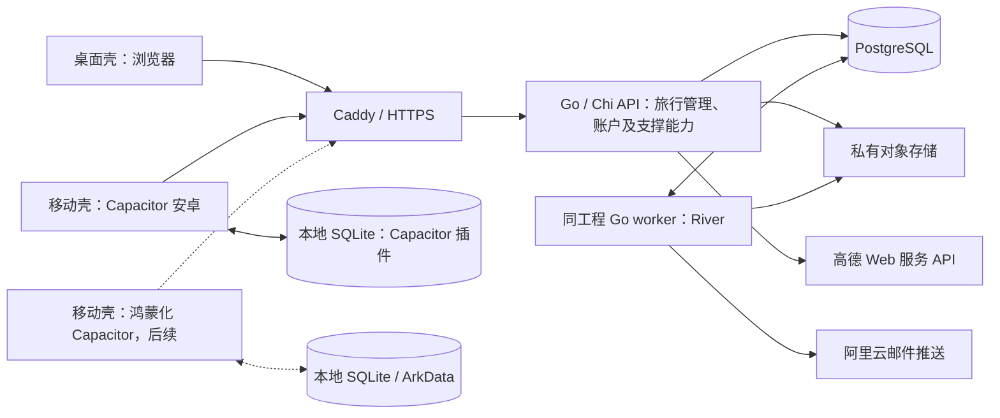

# Tripfolio 技术选型与架构建议 v0.4

日期：2026-09-10；v0.3、v0.4 修订于 2026-09-12  
依据：P0 核心需求清单 v0.3，以及本轮明确的安卓、网页、后续原生鸿蒙支持要求。  
开发方式：个人以 AI 完成主要开发，个人辅助部署、维护和设备验证。  
状态：架构建议稿；组件能力已核对官方资料，工程兼容性与业务性能尚未进行原型验证。  
v0.4 修订：用户确认移动端采用 Capacitor + Vue 3（与网页共用一个前端工程），邮件投递采用阿里云邮件推送；第 1–5、7、8、9、10 节据此改写，第 11 节保留候选对比作为决策记录。  
v0.3 修订：地图与定位确定采用高德开放平台；新增邮件投递候选（第 3.1 节）与移动端技术栈候选对比（第 11 节）。

## 1. 推荐结论

采用 **一个 Vue 3 前端工程同时产出网页与 Capacitor 安卓应用 + Go / Chi 模块化单体后端 + PostgreSQL + 托管对象存储 + 高德开放平台 + 阿里云邮件推送**。

先交付网页与安卓，鸿蒙按用户要求后置。前端只有一份 Vue 3 + TypeScript 代码：桌面浏览器加载桌面壳（宽屏多日编排、表格整理），移动浏览器与 Capacitor 应用加载移动壳（四页签详情、快捷记账、拍照、清单勾选）；本地数据库、文件、安全存储、网络状态与定位通过统一的平台接口访问，安卓由 Capacitor 插件实现，网页在 P0 只在线使用。鸿蒙阶段优先验证 Ionic 中国社区维护的鸿蒙化 Capacitor，验证不通过再为鸿蒙单独实现 ArkWeb 壳与 ArkTS 桥接。

选型优先级是维护成本、数据可靠性、服务端性能与内存占用，同时保证工具链可验证性和平台覆盖。Web 与移动端以 TypeScript 开发，服务端以 Go 开发，通过 OpenAPI 契约和共同测试样例保持一致。原生适配限制在 Capacitor 插件与平台接口实现内，业务页面不直接调用平台 API。

部署地域按已选定的高德与阿里云邮件推送判断为中国大陆；对象存储按此优先采用阿里云 OSS，正式确认放在部署设计时。厂商差异通过服务接口隔离。

## 2. 跨端方案比较

候选对比与核对依据见第 11 节，此处只记录结论。

| 方案 | 主要组合 | 结论 |
| --- | --- | --- |
| A：Capacitor + Vue 3，采用 | 网页与安卓共用一个 Vue 3 工程；安卓由 Capacitor 打包；鸿蒙优先验证社区鸿蒙化 Capacitor | 移动端增量工作最小，所需插件均有维护中的版本，高德只需一套 JS 集成，命令行构建可进 CI |
| B：uni-app x | 安卓与鸿蒙用 uni-app x，网页单独 Vue 3 | 鸿蒙路径最正式，但 UTS 的 AI 语料弱、SQLite 只有市场插件、打包依赖 HBuilderX；作为鸿蒙必须与安卓同期交付时的备选 |
| C：Flutter | 安卓用 Flutter，鸿蒙用社区分支，网页单独 Vue 3 | 原生手感最好，代价是第三种语言与两套界面；作为需要更强原生体验时的备选 |
| D：React Native + RNOH | 安卓用 RN，鸿蒙用华为维护的 RNOH | 与 Vue 网页无法复用，RNOH 版本滞后官方多个版本；不采用 |

方案 A 的插件与鸿蒙路径尚未经本项目验证，正式开发页面前先完成第 10 节的验证项。

## 3. 技术清单

| 层次 | 推荐技术 | 本项目中的用途 |
| --- | --- | --- |
| 前端工程 | Vue 3 + TypeScript + Vite，一个工程两个壳 | 桌面壳：多日行程编排、资料整理、账目查改、统计与账户页；移动壳：四页签详情、快捷记账、拍照、清单勾选；按路由与平台懒加载 |
| 路由与状态 | Vue Router + Pinia | 页面路由和界面状态；持久业务数据由服务端或本地数据库管理 |
| 界面组件与图表 | 桌面壳 Element Plus；移动壳 Vant 4；图表 ECharts 两端共用 | 两套组件库只在各自壳的路由中加载，移动包不含 Element Plus |
| 安卓端 | Capacitor 8.x（工程骨架锁定 8.5.2，2026-09-12 核对）+ 同一 Vue 工程的移动壳；构建安卓包需 JDK 21 与 Android SDK | 系统 WebView 承载移动壳；相机与相册、定位、文件、安全存储、网络状态由 Capacitor 插件提供 |
| 鸿蒙端，后续 | Ionic 中国社区 CPF-Ionic 的鸿蒙化 Capacitor（hionic CLI，OpenHarmony 5.0+）优先验证；不通过则自建 ArkWeb 壳 + ArkTS 桥接 | 复用同一移动壳；需核实 SQLite、Filesystem、Geolocation、Camera、Preferences 的鸿蒙版与应用市场审核 |
| 安卓本地数据库 | @capacitor-community/sqlite（SQLite，支持事务、迁移语句集与可选加密） | 已下载旅行、离线账目、清单与待办状态、待同步操作；每个账号一个数据库文件 |
| 鸿蒙本地数据库 | 同一插件的鸿蒙化版本；不可用时以 ArkTS 桥接 ArkData 关系型数据库实现同一接口 | 与安卓保持一致的数据语义和同步协议；具体事务与迁移行为需验证 |
| 服务端语言与工具链 | Go 1.27.x 受支持稳定分支 | 原生编译、静态类型和统一工具链；固定验证通过的补丁版本 |
| HTTP 路由 | chi v5 + 标准库 net/http | 轻量路由、中间件和请求超时；沿用标准 HTTP 接口 |
| 数据访问 | sqlc + pgx v5 | 由 SQL 生成类型安全的 Go 查询代码，显式管理事务、锁和连接池 |
| 数据库迁移 | Goose + 受版本控制的 SQL 文件 | 管理业务表结构变更；River 自有表按其官方迁移流程管理 |
| 主数据库 | PostgreSQL 18，生产优先托管 | 账号、旅行、预算、账单分类、账目、预订、资料、照片、文件元数据、同步记录 |
| 文件存储 | 托管对象存储；大陆部署优先评估 OSS，其他地域可选择 S3 等 | 私有照片、PDF、票据、缩略图和导出包 |
| 后台任务 | River + 独立 Go worker 进程 | 导出、缩略图、回收站清理、账号数据删除及重试任务，复用 PostgreSQL |
| API 契约 | HTTPS REST + OpenAPI 3.0.x + oapi-codegen | 从统一契约生成 Go 接口模型与处理器接口，并生成或校验客户端模型 |
| 账号认证 | golang-jwt/jwt/v5 + Argon2id + 可撤销刷新会话 | 短期访问凭证、账号找回、会话撤销和多端登录；密码与会话规则集中处理 |
| 入口与证书 | 外层反向代理（Nginx / Caddy / 云负载均衡）+ 应用内置静态服务 | 2026-09-15 起后端交付单二进制：前端产物 embed 进二进制，静态资源、SPA 回退、高德 JS API 安全密钥代理都在进程内完成，不再需要容器内 Caddy；HTTPS 由外层已有代理承担，见 [单二进制部署设计](../architecture/2026-09-15-单二进制部署设计.md) |
| 地图与定位 | 高德开放平台：网页壳与移动壳都在 WebView / 浏览器内使用 JS API 2.0；定位用 Capacitor Geolocation 取系统坐标后转换，或用 JS API 定位插件；服务端代理 Web 服务 API | 行程选点与地点搜索、照片位置获取与逆地理编码、拉起高德导航；全部坐标以 GCJ-02 保存 |
| 邮件投递 | 阿里云邮件推送（DirectMail），2026-09-12 确认；候选对比见 3.1 | 注册与找回密码的验证码 |
| 容器与部署 | Docker + Docker Compose | 本地依赖、服务端构建、API 与 worker 部署 |
| 日志与健康检查 | Go 标准库 log/slog + 健康检查 + 云监控 | 结构化日志、请求与任务编号；按需使用 pprof 定位资源消耗 |
| 工程组织 | 单代码仓库；前端 pnpm workspace，后端 Go Modules | 分别管理前后端工具链，共用接口契约与业务测试样例 |
| 自动验证 | Go testing、httptest、竞态检测；前端 Vitest、Playwright；安卓 Gradle 构建与真机验证 | 验证后端规则与并发、网页操作及移动系统能力 |

本次核对时，Go 1.27 与 1.26 属于官方受支持分支；新项目优先选择依赖验证通过的 Go 1.27.x。Go 的支持策略与 Node.js LTS 命名不同，需要跟进受支持分支的更新。PostgreSQL 18 处于官方支持期；若托管数据库只提供受支持的 PostgreSQL 17，可在一致性测试后采用 17。前端构建可使用 Node.js 24 LTS 与 pnpm，后端部署 Go 编译产物。

### 3.1 邮件投递候选（2026-09-12 核对，已选定阿里云邮件推送）

验证码邮件量极小（每次注册或找回一封），任何候选的免费额度都远超 P0 需要；决定因素是对 QQ、163 等国内邮箱的到达率、与部署地域和对象存储是否同一账号，以及是否需要备案域名。用户于 2026-09-12 确认采用阿里云邮件推送；其余候选保留为更换时的参考。

| 候选 | 免费额度 | 超出后 | 适用判断 |
| --- | --- | --- | --- |
| 阿里云邮件推送 DirectMail | 每主账号共 2000 封免费，每天最多 200 封；用完即止 | 按量 2 元 / 1000 封 | 部署在大陆、对象存储用 OSS 时的首选：同一账号、国内邮箱到达率好、Go SDK 齐全；2000 封用完后成本仍可忽略 |
| 腾讯云邮件推送 SES | 每账号共 1000 封免费，不限期 | 按量付费 | 与阿里云同类，若云账号在腾讯云则选它 |
| Resend | 每月 3000 封、每天 100 封、3 个域名，长期免费 | 20 美元/月起 | 部署在境外时的首选，开发体验最好；从境外 IP 投递到国内邮箱有一定进垃圾箱风险 |
| Brevo | 每天 300 封，长期免费 | 39 美元/月起 | 境外备选；控制台偏营销邮件 |
| Amazon SES | 2026 年 7 月起取消 SES 专属免费额度，按量约 0.16 美元 / 1000 封 | 同左 | 已在 AWS 上时可用，需申请退出沙箱 |
| SendGrid | 2025 年 5 月起取消免费计划，只剩 60 天试用 | 付费 | 不再作为免费候选 |

无论选哪家，都需要自有域名并配置 SPF、DKIM、DMARC 记录，发信地址使用独立子域（如 mail.example.com），验证码邮件用事务型通道；投递调用放在数据库事务之外，失败由用户重新申请验证码。邮件供应商只出现在 adapters/mail，更换不影响业务代码。

## 4. 前端与平台边界

### 4.1 一个工程，两个壳

前端只有一个 Vue 3 工程。桌面壳面向宽屏浏览器：多天对照、表格、批量整理；移动壳面向手机浏览器与 Capacitor 应用：四页签旅行详情、今日行程、快捷记账、拍照、清单勾选。启动时按视口宽度与 Capacitor 平台标识选择壳，两套页面各自懒加载，共用路由约定、状态、接口客户端、金额与日期规则和同步逻辑。

同一份构建产物同时被 Caddy 作为网页静态资源发布、被 Capacitor 打进安卓包；不维护第二套移动界面。鸿蒙阶段复用移动壳，只补平台接口实现。

### 4.2 共享范围

- **完全共享：** 页面与组件（各壳内）、OpenAPI 生成的客户端模型、错误码、金额规则、同步协议实现、Pinia 状态、业务测试用例。
- **按平台实现：** 本地数据库、文件与相机、安全存储、网络状态、定位、导航拉起。它们只出现在 `src/platform/` 的接口与实现中：`capacitor/` 由 Capacitor 插件实现，`web/` 在 P0 只提供在线实现（无本地数据库），`ohos/` 在鸿蒙阶段补充。
- **服务端权威：** 权限、账目校验、预算统计口径和同步冲突判断；客户端校验用于及时反馈和离线体验。

网页离线不在 P0 范围；同一平台接口后续可用浏览器内 SQLite（如 wa-sqlite）实现，不改业务代码。

### 4.3 原生能力与 Capacitor 约束

- 插件清单（P0）：@capacitor/camera（拍照与相册多选）、@capacitor/filesystem、@capacitor/geolocation、@capacitor/network、@capacitor/preferences、@capacitor/app、@capacitor/browser 或 App Launcher（拉起高德导航）、@capacitor-community/sqlite（本地数据库）、安全存储用 Android Keystore 支持的社区插件保存 refresh token。版本组合验证通过后固定。
- 身份凭证：Capacitor 应用的页面来源是 `https://localhost`，与 API 域不同源，因此按接口设计 3.1 的“原生端”流程处理：client.kind 为 android 或 harmony，refresh token 放请求正文并存安全存储，access token 只在内存，不使用 Cookie 与 CSRF 机制。API 与 Caddy 的 CORS 允许来源包含该 Capacitor 来源和网页域。
- 文件上传：WebView 内用 XMLHttpRequest 直传对象存储的签名地址以取得进度；对象存储桶需配置允许网页域与 Capacitor 来源的 CORS（PUT、Content-Type、暴露 ETag）。相册选取的 HEIC 图片需在客户端转为 JPEG 后上传，属第 10 节验证项。
- 高德：移动壳与桌面壳同样通过 JS API 2.0 加载地图与选点；安全密钥由 Caddy 在代理路径追加，该路径需对 Capacitor 来源返回 CORS 头。设备定位取得 WGS-84 坐标后转换为 GCJ-02 再提交。
- 同步触发：应用启动、回到前台（@capacitor/app 的状态事件）、网络恢复（@capacitor/network）、用户手动同步与前台操作后；不做后台任务。
- 鸿蒙：华为应用市场对纯 Web 套壳审核有阻碍，鸿蒙版必须带离线数据库、相机、定位等原生能力并做鸿蒙特性适配；鸿蒙化 Capacitor 为社区维护，关键插件逐个核实后再决定是否走自建 ArkWeb 壳的退路。

## 5. 后端：模块化单体

后端先维护一套 Go 工程，按业务模块隔离职责。API 和 River worker 使用同一代码库与发布版本，以不同进程启动。通过构造函数显式装配依赖，各模块保持清晰的 handler、service、store 职责。

Chi 是 HTTP 路由库，业务分层、错误处理、校验和认证仍由项目统一规范。OpenAPI 生成处理器接口与模型，sqlc 生成数据库访问代码，业务规则集中在 service 层，避免把大量逻辑堆进路由处理器。

| 模块 | 职责 |
| --- | --- |
| 旅行管理 | 旅行基础、每日行程、行李清单、待办、总预算、账单分类、账目、开支统计、预订与资料、相册 |
| 账户 | 身份、个人资料、会话、私有数据访问、注销 |
| 同步支持 | 操作去重、版本校验、变更记录、游标、冲突与删除同步 |
| 文件与导出支持 | 文件元数据、上传授权、下载授权、导出、清理和任务状态 |

同步和文件属于内部支撑能力，不改变产品界面中的两个大模块。各模块通过明确的应用服务协作，避免页面接口直接操作其他模块的内部数据。



### 5.1 后端候选比较

| 维度 | Go + Chi，推荐 | Java + Spring Boot | Rust + Axum |
| --- | --- | --- | --- |
| 可维护性 | 语言与工具链集中，依赖可以较少；需要固定业务分层、错误和校验规范 | 生态成熟、约定完整，适合 Java 维护经验较强的团队；框架与依赖体系更大 | 类型和内存约束强，所有权、生命周期及异步类型提高实现与排错门槛 |
| 性能 | 适合并发网络服务；编译执行，便于控制并发任务 | 优化后的吞吐表现也很强，常规 JVM 部署存在预热与运行时调优因素 | 适合对资源和延迟有严格要求的服务，但工程复杂度更高 |
| 内存倾向 | 轻量服务通常有较低的常驻开销，仍需要 GC、连接池和并发预算 | 常规 JVM + Spring 部署通常有较高的基础开销；Native Image 需单独评估 | 有低开销潜力，实际峰值仍受分配、缓存和任务并发影响 |
| 本项目适配 | 综合符合个人维护、并发接口和低资源占用目标 | 有既有 Java 技术积累或企业集成要求时值得优先考虑 | 目前业务需求不足以抵消额外的实现复杂度 |

以上是常规部署形态下的选型判断，不是本项目压测排名。Java 的实际性能可能优于某个 Go 实现；数据库查询、网络等待和文件处理也可能比语言运行时更早成为瓶颈。

### 5.2 为什么选择 Go 与 Chi

- Go 的静态类型、统一格式化、标准测试和模块工具便于形成稳定的 AI 开发约定。
- 采用纯 Go 的 API 依赖时，可交付原生可执行文件，运行与回退流程较简单；引入原生图片库时需另外管理系统依赖。
- goroutine 与 context 适合并发 I/O、取消和超时处理；请求与作业仍应有明确的并发上限。
- Chi 与 net/http 兼容，路由层较薄，HTTP 中间件和测试容易组合。
- Gin 同样是可用选择。这里选择 Chi 的依据是标准库兼容与较小依赖范围，路由微基准不是主要决策依据。

前后端采用两种语言会增加一部分规则重复维护成本。通过 OpenAPI 生成类型和接口、复用 JSON 测试样例、验证金额与日期边界，可以控制这项成本；客户端传入的数据仍由后端重新校验。

### 5.3 数据访问与任务队列的配套选择

sqlc 把明确的 SQL 编译成类型安全的 Go 查询代码，pgx 提供 PostgreSQL 驱动、事务与连接池。退款关联、费用聚合、操作去重和同步游标需要清晰的事务边界，这个组合便于审查实际执行的查询。

Goose 管理业务 SQL 迁移，River 管理自身队列表迁移，两者都纳入同一个发布流程。River 支持通过 pgx 事务入队，使业务数据和任务一起提交，减少数据已保存但任务未入队的失败窗口。worker 需要实现幂等处理，并为不同任务类型设置并发和重试规则。

### 5.4 性能与内存控制

- 分别限制 API 与 worker 的数据库连接池、请求超时和任务并发；数据库连接也会消耗服务端资源。
- 导出使用分页读取与流式写出，文件按授权直接上传对象存储，图片处理限制解码尺寸与并发。
- 为密码哈希等高资源操作设置并发限制，使用合适的安全参数。
- 通过 pprof、进程 RSS、容器内存、GC 与连接池指标定位问题；性能诊断入口仅在受控运维环境使用。
- 根据容器预算配置 GOMEMLIMIT，并为 Go 运行时未管理的开销留余量。它是软限制，不能保证进程始终低于某个硬上限。

验收时使用实际旅行列表、账本查询、离线同步批次与文件任务，记录空闲及负载下的内存、P95/P99 延迟、错误率、CPU 和数据库连接数。当前没有实现和业务压测，因此不承诺固定的 MB、QPS 或性能提升倍数。

## 6. 数据库与文件设计原则

- PostgreSQL 保存关系数据：账号、旅行、行程、清单、待办、账单分类、账目、预订、资料、照片与文件元数据。
- 使用外键、唯一约束、事务及合理索引保证关联和金额记录一致，主要查询按账号和旅行限定范围。
- 金额使用 PostgreSQL `NUMERIC` 等精确类型，API 使用十进制字符串，Go 侧使用明确的十进制数值表示与转换；sqlc/pgx 数据库类型经 DTO 转换后再输出，客户端计算也遵循精确金额规则。
- 一趟旅行使用一种币种，保留币种字段；时间点按统一格式存储，旅行日期使用日期语义，为后续时区能力保留扩展位置。
- 照片、票据、PDF 和导出包保存在私有对象存储，数据库记录对象标识、归属、类型、大小和状态。
- 上传和下载先校验账号与旅行归属，再使用短期授权；持久记录对象标识，临时签名 URL 按需生成。
- 客户端可直接向已授权的存储地址上传，服务端确认文件状态后建立业务关联；缩略图在后台生成。
- 所有关联查询与文件操作都验证资源归属，不能仅凭客户端传来的旅行编号决定访问权限。

初版旅行搜索和开支统计使用 PostgreSQL 查询。后续出现明确的空间查询需求时可增加 PostGIS，需要更复杂检索时再评估专用搜索系统。

## 7. 离线同步：需要最先设计的核心机制

### 7.1 本地保存与待同步操作

安卓离线允许的业务操作，将业务记录与待同步操作写入同一个 SQLite 事务。界面从本地数据读取，显示待同步状态；应用重启后记录仍存在。

每条离线新增记录使用稳定的客户端 ID，每个提交操作使用唯一操作 ID。Pinia 和临时网络缓存只承担界面职责。

### 7.2 推送与去重

客户端上传操作 ID、记录 ID、基础版本与修改内容。服务端在事务内检查归属、验证业务规则、处理重复操作、保存记录和变更日志。

重复提交同一操作返回已处理结果，避免断网重试产生重复账目。新操作按基础版本检查并发修改，不能直接覆盖另一设备的新数据。

### 7.3 拉取变更

服务端为账号提供不透明的增量同步游标，返回分页变更及删除标记。所有修改入口，包括网页在线操作，都进入同一变更机制。

游标必须保证已提交变更不会漏读。首版可在账号维度用数据库事务锁管理变更序列，将记录、序列与日志一起提交；不依赖设备时间，也不能直接把任意自增 ID 当作可靠的提交顺序。

### 7.4 冲突与删除

- 同一记录在两个设备修改时，保留相关版本，提示选择保留内容。
- 新增不同账目可以并存，同一账目的金额冲突由用户处理。
- 删除作为带版本的变更同步，已删除旅行不会被旧设备的离线修改自动恢复。
- 回收站与变更日志有各自保留策略；游标过期时执行全量核对，保留本地待同步操作后再处理差异。
- 文件同步与文字记录分别跟踪状态，未下载文件不能显示为可离线使用。

### 7.5 同步触发

优先在应用启动、回到前台、网络恢复、用户手动同步及前台操作后同步。后台执行受移动系统限制，设计上允许延迟，不能承诺应用关闭后始终立即同步。

鸿蒙客户端后续复用同一移动壳与同步实现，只替换平台接口的实现。协议独立于 Capacitor、Vue、SQLite 或 ArkData 的具体实现。

## 8. 中间件与部署

### P0 基础设施

- 应用进程（单二进制）：同时提供 HTTP 业务接口、内嵌前端静态资源与 `/_AMapService` 代理；数据库迁移在启动时自动完成。
- 外层反向代理（可选）：已经有 Nginx / Caddy / 云负载均衡时，用它终结 HTTPS 并转发 `/`、`/api/*`、`/health/*`、`/_AMapService/*` 到应用进程；应用本身不内置证书。
- Go worker：与 API 同进程运行（`tripfolio serve` 内部启动 River 客户端）；后台任务并发仍由 `TRIPFOLIO_WORKER_MAX_JOBS` 限制。
- PostgreSQL：业务数据、会话相关持久数据、同步记录及任务队列。
- 托管对象存储：照片与资料，承担持久文件保存。
- 高德开放平台：两类凭证分开申请与管理。JS API key 配合安全密钥，桌面壳与移动壳共用；安全密钥不写入前端，由应用进程内的 `/_AMapService` 代理（本地开发由 Vite 开发代理）覆盖 jscode 后转发，并对网页域与 Capacitor 来源返回 CORS 头。Web 服务 API key 只在 Go 服务端使用，经 /geo 代理接口对客户端开放并按账号限流。如后续引入高德原生定位 SDK 再申请安卓 key。个人认证开发者的免费月配额（2025 年 5 月起：基础 LBS 服务 15 万次/月、JS 地图初始化与定位 150 万次/月、关键字搜索类 5000 次/月）自认证起一年有效，且以非商业目的为前提；产品对外发布前需在高德控制台确认商业目的的界定与到期后的续期或购买方式，并把搜索类调用（地点搜索）控制在配额内，逆地理编码结果做服务端缓存。
- 阿里云邮件推送：发信域名配置 SPF、DKIM、DMARC 与 CNAME 校验属于上线前置项；发信地址用独立子域；免费额度共 2000 封、每天最多 200 封，超出按量 2 元 / 1000 封。
- CORS：应用进程的允许来源为网页域和 Capacitor 应用来源（`https://localhost`）；对象存储桶单独配置直传 CORS。

River 官方文档说明其可复用 PostgreSQL，并通过事务入队与业务修改一起提交。应用层仍需保证任务幂等，文件处理等外部操作不能依赖笼统的“只执行一次”假设。客户端的离线待同步操作与 River 的服务器后台任务队列分别实现。

### 随负载引入的组件

| 组件 | 引入条件 |
| --- | --- |
| Redis | 多 API 实例需要共享限流、短期缓存或其他明确的低延迟状态 |
| 独立消息系统 | PostgreSQL 任务队列已成为经过测量的瓶颈，或出现跨服务事件需求 |
| 专用搜索系统 | 数据规模和检索能力超出 PostgreSQL 的实际可维护范围 |
| 容器集群编排 | 多节点部署、弹性扩缩和服务数量带来明确运维需求 |

P0 单 API 实例可使用兼容 net/http 的限流中间件，并将验证码、会话与操作去重等需要持久保证的数据存入 PostgreSQL。

### 推荐部署方式

开发阶段使用 Docker Compose 管理本地数据库和后端依赖。生产采用一台 Linux 主机运行 Caddy、Go API 与 Go worker，数据库优先使用托管 PostgreSQL，对象存储使用云服务。Go 采用多阶段镜像构建，运行镜像包含业务程序与必要的证书、时区数据等资源，编译工具链留在构建阶段。

如果初期预算要求 PostgreSQL 同机部署，需要同时安排数据库备份、独立存储位置和恢复演练。用户导出功能与生产备份分别设计，回收站也不能替代备份。

先采集请求耗时、错误率、数据库容量、任务失败和磁盘空间。日志避免写入认证凭证、完整订单资料和照片说明等私人内容；错误定位依靠请求与任务编号。

## 9. 适合个人与 AI 协作的工程组织

建议目录职责如下，实际目录在工程骨架阶段建立：

```text
apps/
  client/              一个 Vue 3 工程：src/desktop（桌面壳）、src/mobile（移动壳）、src/shared（状态、接口客户端、同步、规则）、src/platform（平台接口及 capacitor/、web/、后续 ohos/ 实现）；android/ 为 Capacitor 生成的安卓工程，后续 ohos/
  server/              Go API 与 River worker；独立 go.mod / go.sum
packages/
  contracts/           OpenAPI、错误码、接口规则和跨语言 JSON 测试样例
docs/
  requirements/        需求与技术决策
infra/                 部署、迁移、备份与 CORS 配置
```

前端依赖由 pnpm 管理，后端依赖由 Go Modules 管理；同一仓库内保留各自的锁定与生成配置。安卓构建依赖 JDK、Android SDK 与 Gradle，通过 `npx cap sync android` 与 Gradle 命令行完成，可进入持续集成；后续鸿蒙构建依赖 DevEco Studio 与 hionic。

工程约束建议：

1. 在仓库保留接口契约、数据库迁移、模块边界和开发约定，AI 修改时同步更新对应文档。
2. 固定验证通过的版本组合，升级框架时单独验证构建与关键数据流程。
3. 使用持续集成检查 OpenAPI/sqlc 生成结果、Go 格式与静态检查，运行 Go 业务测试、竞态检测和 PostgreSQL 集成测试，同时运行前端类型检查、单元测试与网页关键流程；安卓包由 Gradle 在持续集成中构建，真机验证保留为发布前步骤。
4. 重点验证退款统计、跨账号隔离、重复提交、同步冲突、游标分页、删除恢复、数据库升级与导出完整性。
5. 生产变更通过迁移执行，发布保留可回退的应用版本，并明确数据库迁移的恢复方式。

## 10. 实施前的技术验证范围

技术选型文档并不等于已经通过兼容性测试。下一步建议验证以下最小流程，再开始完整业务页面开发：

| 验证项 | 要验证的结果 |
| --- | --- |
| 安卓构建 | 同一份 Vue 构建产物经 `npx cap sync android` 与 Gradle 命令行可重复产出正式签名包并安装；固定 Capacitor、插件、Gradle 与 JDK 版本 |
| SQLite 数据链路 | @capacitor-community/sqlite 的事务、迁移语句集、应用重启后的数据保留，以及按账号分库隔离。2026-09-12：本机以同一套代码在 Node 内置 sqlite 上通过；真机步骤见 `docs/architecture/2026-09-12-本地数据库数据链路.md` |
| 离线同步 | 断网新增账目，重启后记录仍在，联网同步到网页且不重复 |
| 并发修改 | 安卓与网页修改同一笔账目时能保留并处理冲突 |
| 文件链路 | 相机拍照与相册多选、HEIC 转 JPEG、XMLHttpRequest 直传对象存储并显示进度、失败重试、下载指定资料及离线查看 |
| 凭证与 CORS | Capacitor 来源下 Bearer 与刷新流程、安全存储保存 refresh token、API 与对象存储 CORS 配置生效 |
| 后端事务与后台任务 | 业务提交时任务可见、事务回滚时任务不执行，重试不会重复产生业务结果 |
| 资源占用与业务性能 | 在明确的机器、数据量、并发及运行时配置下记录内存和延迟，分别观察 API、worker 与数据库 |
| 鸿蒙兼容性审查 | 核实鸿蒙化 Capacitor 的 SQLite、Filesystem、Geolocation、Camera、Preferences 插件可用性与应用市场审核要求，明确需补充的适配或退路 |
| 高德接入 | 桌面壳与移动壳经代理路径加载 JS API 并完成选点；Capacitor 定位取得坐标并转换为 GCJ-02；服务端代理逆地理编码与地点搜索命中限流与缓存；拉起高德导航 |
| 邮件到达率 | 用阿里云邮件推送向 QQ、163、Gmail、Outlook 各发送验证码邮件，确认进入收件箱且 SPF、DKIM、DMARC 校验通过 |

鸿蒙业务开发仍安排在最后。进入该阶段后，单独完成鸿蒙包的构建、安装和上述数据链路的真机验收；安卓 APK 运行情况不作为鸿蒙支持的验收依据。

如果 Capacitor 的数据库插件或构建维护成本明显超出预期，再在大量页面开发前切换到第 11 节的备选方案。后端、PostgreSQL、文件存储、同步协议和业务测试可继续沿用。

## 11. 移动端技术栈候选对比（2026-09-12 核对；用户已确认采用 Capacitor + Vue 3）

背景：P0 交付网页（Vue 3）与安卓，鸿蒙原生后置；个人以 AI 为主开发；必须具备离线 SQLite、相机与相册、定位、文件上传、安全存储；地图采用高德。以下对比只针对这些约束，不是通用排名。

| 维度 | Capacitor + Vue 3 | Flutter | uni-app x | React Native + RNOH | 原生 Kotlin + ArkTS |
| --- | --- | --- | --- | --- | --- |
| 安卓成熟度 | 高；WebView 渲染，适合表单、列表与相册类应用 | 高；自绘渲染，原生手感最好 | 中；编译为 Kotlin，官方组件为主 | 高；Expo 生态完整 | 最高 |
| 鸿蒙路径 | Ionic 中国社区 CPF-Ionic 的鸿蒙化 Capacitor（hionic CLI，OpenHarmony 5.0+，已适配 14 个官方插件与 62 个三方插件）；非 Ionic 官方 | OpenHarmony-SIG 维护的 Flutter 分支（2026 年起按季度跟进官方版本，仍落后官方数个版本）；非 Flutter 官方 | DCloud 官方：4.61+ 编译为 ArkTS，2026-05 起蒸汽模式；路径最“正式” | 华为维护的 RNOH，支持 RN 0.72.5 与 0.77.1（官方 RN 已到 0.83）；Expo 模块不可用 | 华为官方 |
| 离线 SQLite | @capacitor-community/sqlite 8.x（2025-10 起由 Capawesome 维护者接手，8.1.1 支持 Capacitor 8）；鸿蒙化版本待核实 | drift / sqflite 成熟；鸿蒙分支有 sqflite 移植 | 只有插件市场的 UTS 插件，事务与迁移能力需逐个验证 | op-sqlite / expo-sqlite；RNOH 上需用社区移植版 | Room / ArkData RDB |
| 相机、定位、安全存储、文件 | 官方插件齐全（Camera、Geolocation、Filesystem、Preferences、Secure Storage 社区插件）；@capacitor-ohos/camera、capacitor-preferences 已鸿蒙化 | 插件齐全；鸿蒙分支已移植常用插件 | uni API 覆盖，HEIC 转换等细节需验证 | Expo 齐全；RNOH 需社区版 | 系统 API |
| 高德接入 | 与网页共用高德 JS API 2.0（WebView 内加载），定位用 Capacitor Geolocation 或高德 JS 定位；只维护一套地图代码 | 高德官方 Flutter 插件（amap_flutter_map / location），维护节奏不稳定 | 内置 map 组件与定位 API 对接高德 | 社区 react-native-amap3d | 高德 Android SDK / 鸿蒙 SDK |
| 与 Vue 网页复用 | 同一份 Vue 代码，按路由区分桌面与移动页面；网页与安卓只有一个前端工程 | 无 UI 复用，只共享 OpenAPI 生成模型 | Vue 语法但组件与 API 不同，页面不能直接复用 | 无 UI 复用 | 无 |
| AI 代码生成语料 | 最好（Vue、TS、Capacitor） | 很好（Dart） | 弱（UTS、DCloud 专有 API） | 很好（TS、RN） | Kotlin 很好；ArkTS 中等且以中文资料为主 |
| 工具链与 CI | Vite + Gradle 命令行，可重复构建 | flutter 命令行，可重复构建 | App 打包依赖 HBuilderX；uni cli 在 App 平台只生成 wgt 资源包 | Gradle + Metro | Gradle / DevEco |
| 主要风险 | 鸿蒙依赖社区版 Capacitor；华为应用市场对“纯 Web 套壳”审核有阻碍，需带离线库、相机、定位等原生能力并做鸿蒙特性适配 | 第三种语言；鸿蒙分支版本滞后；网页仍需单独开发 | 单一供应商与 IDE 锁定；SQLite 未验证；AI 语料弱 | 网页是 Vue，RN 无法复用；RNOH 版本滞后 | 三套界面代码，个人维护负担最大 |

推荐：**P0 采用 Capacitor + Vue 3**，网页与安卓共用一个前端工程；本地数据库、文件、安全存储、网络、定位通过 packages/platform-adapters 的接口访问，安卓由 Capacitor 插件实现，网页由浏览器实现或不提供离线。鸿蒙阶段优先验证 CPF-Ionic 鸿蒙化 Capacitor（重点核实 SQLite、Filesystem、Geolocation 插件与应用市场审核），验证不通过再为鸿蒙单独实现 ArkWeb 壳与 ArkTS 桥接，或以 Flutter 重建移动端。选择依据：P0 验收只要求网页与安卓，一套 Vue 代码把移动端的工作量降到最低；所需插件都有维护中的版本；高德只需一套 JS 集成；命令行构建可进入 CI。

不选 uni-app x 的原因：它在鸿蒙上的路径最正式，但代价落在 P0 当前最需要的地方：UTS 与专有 API 的 AI 语料弱、SQLite 只有市场插件、App 打包依赖 HBuilderX。若鸿蒙必须与安卓同期交付且可以接受这些代价，uni-app x 是次选；Flutter 是希望移动端原生手感更强时的次选。

用户于 2026-09-12 确认采用 Capacitor + Vue 3；第 1–5、7、8、9、10 节已按此改写，本节保留为决策记录。

## 12. 官方资料与核对结果

以下资料于 2026-09-10 阅读，用于平台支持、组件行为和版本判断；官方示例、模拟图和框架微基准均未作为本项目实测结论。具体依赖以验证通过的发布版本为准。

1. [uni-app x 官方介绍](https://doc.dcloud.net.cn/uni-app-x/)：声明支持 Android、iOS、鸿蒙、Web 等平台，说明组件、CSS 与插件边界。
2. [uni-app x 蒸汽模式](https://doc.dcloud.net.cn/uni-app-x/app-vapor.html)：说明不同平台的编译模式与 HBuilderX 版本要求。
3. [uni-app x API 概述](https://doc.dcloud.net.cn/uni-app-x/api/)：说明原生能力封装，以及不再支持旧 plus、weex API。
4. [React Native 独立平台](https://reactnative.dev/docs/out-of-tree-platforms)：列出 React Native OpenHarmony 项目。
5. [Flutter 支持平台](https://docs.flutter.dev/reference/supported-platforms)：官方列表包含 Android、iOS、桌面和 Web，未列出鸿蒙。
6. [Expo SQLite](https://docs.expo.dev/versions/latest/sdk/sqlite/)：说明安卓等平台的持久 SQLite 能力；文档仍将其 Web 支持标注为 alpha。
7. [Go 发布与支持策略](https://go.dev/doc/devel/release)：本次核对时最新稳定版本为 Go 1.27.1，1.27 与 1.26 受支持。
8. [Chi 官方仓库说明](https://raw.githubusercontent.com/go-chi/chi/master/README.md)：轻量 HTTP 路由与 net/http 兼容性。
9. [sqlc 官方仓库说明](https://raw.githubusercontent.com/sqlc-dev/sqlc/main/README.md)：从 SQL 生成类型安全的数据库查询代码。
10. [Goose 官方仓库说明](https://raw.githubusercontent.com/pressly/goose/master/README.md)：SQL 与 Go 数据库迁移及 PostgreSQL 支持。
11. [River 官方入门](https://riverqueue.com/docs)：PostgreSQL、pgx 驱动、迁移、worker 并发与事务入队。
12. [River 事务入队](https://riverqueue.com/docs/transactional-enqueueing)：任务与业务修改一起提交的语义。
13. [oapi-codegen 官方仓库说明](https://raw.githubusercontent.com/oapi-codegen/oapi-codegen/main/README.md)：从 OpenAPI 生成 Go 模型与服务端接口；实际采用固定发布版本。
14. [Go 垃圾回收指南](https://go.dev/doc/gc-guide)：GOMEMLIMIT 的内存范围、软限制与 GC 取舍。
15. [PostgreSQL 版本策略](https://www.postgresql.org/support/versioning/)：主版本支持期为五年，本次核对时 18 与 17 均受支持。
16. [Node.js 版本支持](https://nodejs.org/en/about/previous-releases)：前端构建可采用 Node.js 24 LTS。

以下资料于 2026-09-12 核对，用于第 3.1、8、11 节：

17. [uni-app x 鸿蒙开发指南](https://doc.dcloud.net.cn/uni-app-x/app-harmony/)：4.61+ 支持纯血鸿蒙，编译为 ArkTS。
18. [uni cli 脚手架说明](https://uniapp.dcloud.net.cn/worktile/CLI.html)：App 平台仅支持生成离线打包的 wgt 资源包。
19. [Flutter 鸿蒙 2026 路线](https://gitee.com/CarGuo/GSYFlutterBook/blob/master/Flutter-OH-2026-Roadmap.md) 与 [OpenHarmony-SIG/flutter_flutter](https://gitee.com/openharmony-sig/flutter_flutter)：社区分支按季度跟进官方版本。
20. [React Native for 鸿蒙 0.77.1 环境搭建](https://developer.huawei.com/consumer/cn/blog/topic/03203761957348002)：RNOH 支持 0.72.5 与 0.77.1。
21. [CPF-Ionic capacitor-preferences](https://gitcode.com/CPF-Ionic/capacitor-preferences) 与相关介绍：Ionic 中国社区维护的鸿蒙化 Capacitor，hionic CLI，OpenHarmony 5.0+，14 个官方插件与 62 个三方插件已适配。
22. [capacitor-community/sqlite 发布记录](https://github.com/capacitor-community/sqlite/releases)：7.0.0（2025-01）适配 Capacitor 7，7.0.2（2025-10）由新维护者发布。
23. [高德开放平台服务升级](https://lbs.amap.com/upgrade)、[服务协议](https://lbs.amap.com/home/terms/)与[开发者注册页](https://lbs.amap.com/dev/id/)：个人认证开发者非商业目的一年免费月配额；商业目的需技术服务许可。
24. [高德 JS API 安全密钥使用](https://lbs.amap.com/api/jsapi-v2/guide/abc/prepare)：安全密钥经代理服务器转发。
25. [阿里云邮件推送计费](https://help.aliyun.com/zh/direct-mail/billing-methods)：共 2000 封免费、每天最多 200 封，按量 2 元 / 1000 封。
26. [腾讯云邮件推送价格说明](https://cloud.tencent.com/document/product/1288/47930)：每账号 1000 封免费额度。
27. [Resend 定价](https://resend.com/pricing)、[Brevo 免费计划](https://help.brevo.com/hc/en-us/articles/208580669)、[Amazon SES 定价计划公告](https://aws.amazon.com/blogs/messaging-and-targeting/introducing-amazon-simple-email-service-ses-pricing-plans/)、[SendGrid 免费计划变更](https://www.twilio.com/en-us/changelog/sendgrid-free-plan)。
